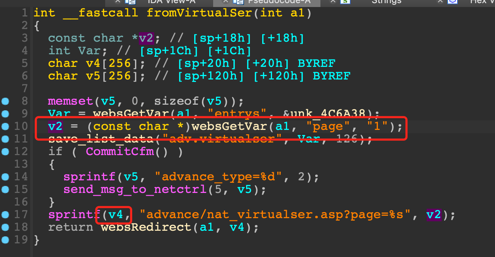

# Tenda FH1203 Vulnerability

This vulnerability lies in the `fromVirtualSer` function which influences the latest version of Tenda FH1203. (The latest version is [V2.0.1.6](https://down.tenda.com.cn/uploadfile/FH1203/fh1203_kfw_V2.0.1.6_cn_svn1134.zip))

## Vulnerability Description

There is a **stack-based buffer overflow** vulnerability in function `fromVirtualSer`.

In function `fromVirtualSer` it reads user provided parameter `page` into `v2`, this variable is passed into function `sprintf` without any length check, which may overflow the stack-based buffer `v4`.

## Timeline

* 2023-07-10: CVE ID assigned (CVE-2023-37707)
