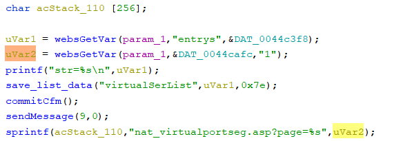

# Tenda 4G300 Vulnerability

This vulnerability lies in the `/VirtualSer` page on the latest version of Tenda 4G300.

## Vulnerability Description

* Binary Path: /cpio-root/bin/httpd
* Entry Url: /VirtualSer
* Affected Versions
    * Tenda 4G300 V1.01.42

    
There is a **stack-based buffer overflow** vulnerability in page `VirtualSer`. An attacker can set `page` field in requests to launch a denial-of-service or remote-code-execution attack.

In function `FUN_0042e914` it reads user provided parameter `page` into `uVar2`, this variable is passed into function `sprintf` without any length check, which may overflow the stack-based buffer `acStack_110`.

## Timeline

