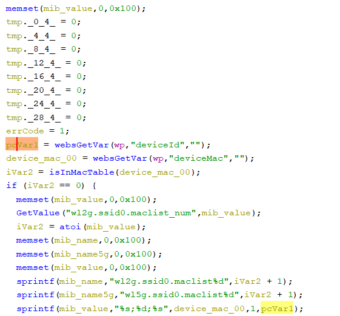

# Tenda Router Vulnerability on addWifiMacFilter function

This vulnerability lies in the `addWifiMacFilter` function in `httpd` binary on certain Tenda devices.

## Vulnerability Description

* Binary Path: /bin/httpd
* Entry Url: /addWifiMacFilter
* Affected Versions
  * AC10 V1.0 V15.03.06.23
  * AC1206 V15.03.06.23
  * AC6 V2.0 V15.03.06.23
  * AC7 V1.0 V15.03.06.44
  * F1203 V2.0.1.6
  * AC5 V1.0 V15.03.06.28
  * FH1203 V2.0.1.6
  * AC9 V3.0 V15.03.06.42_multi
  * FH1205 V2.0.0.7(775)

There is a **stack-based buffer overflow** vulnerability in function `addWifiMacFilter`. An attacker can set `deviceId` field in requests to launch a denial-of-service or remote-code-execution attack.

In function `addWifiMacFilter` it reads user provided parameter `deviceId` into `pcVar1`, this variable is passed into function `sprintf` without any length check, which may overflow the stack-based buffer `mib_value`.

## Timeline
