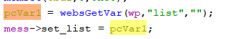

# Tenda Router Vulnerability on setaccount function

This vulnerability lies in the `setaccount` function in `httpd` binary on certain Tenda devices.

## Vulnerability Description

* Binary Path: /bin/httpd
* Entry Url: /cloudv2
* Affected Versions
    * AC10 V1.0 V15.03.06.23
    * AC1206 V15.03.06.23
    * AC8 v4 V16.03.34.06
    * AC6 V2.0 V15.03.06.23
    * AC7 V1.0 V15.03.06.44
    * F1203 V2.0.1.6
    * AC5 V1.0 V15.03.06.28
    * AC10 v4.0 V16.03.10.13
    * FH1203 V2.0.1.6
    
There is a **stack-based buffer overflow** vulnerability in function `setaccount`. An attacker can set `list` field in requests to launch a denial-of-service or remote-code-execution attack.

In function `setaccount` it reads user provided parameter `list` into `pcVar1`, this variable is passed to the `set_list` field of `mess`, which was allocated a limited memory space.

## Timeline
