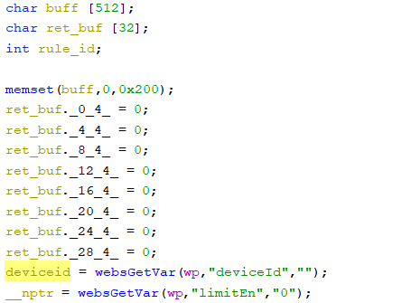
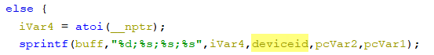

# Tenda Router Vulnerability on formSetClientState function

This vulnerability lies in the `formSetClientState` function in `httpd` binary on certain Tenda devices.

## Vulnerability Description

* Binary Path: /bin/httpd
* Entry Url: /SetClientState
* Affected Versions
    * AC10 V1.0 V15.03.06.23
    * AC1206 V15.03.06.23
    * AC6 V2.0 V15.03.06.23
    * AC7 V1.0 V15.03.06.44
    * F1203 V2.0.1.6
    * AC5 V1.0 V15.03.06.28
    * FH1203 V2.0.1.6
    * AC9 V3.0 V15.03.06.42_multi
    * FH1205 V2.0.0.7(775)
    
There is a **stack-based buffer overflow** vulnerability in function `formSetClientState`. An attacker can set `deviceId` field in requests to launch a denial-of-service or remote-code-execution attack.

In function `formSetClientState` it reads user provided parameter `deviceId` into `deviceid`, this variable is passed into function `sprintf` without any length check, which may overflow the stack-based buffer `buff`.

## Timeline
