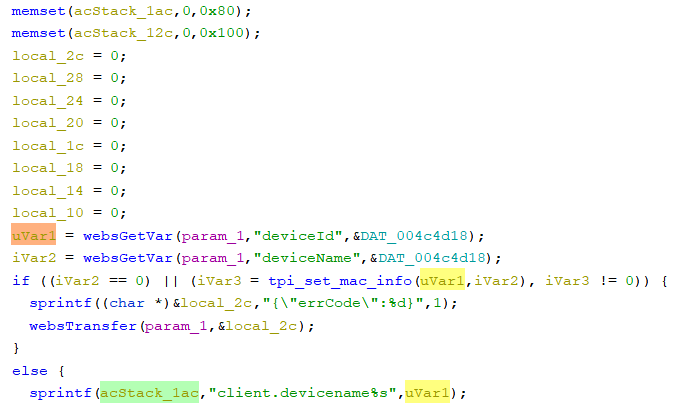

# Tenda Router Vulnerability on formSetDeviceName function

This vulnerability lies in the `formSetDeviceName` function in `httpd` binary on certain Tenda devices.

## Vulnerability Description

* Binary Path: /bin/httpd
* Entry Url: /SetDeviceName
* Affected Versions
    * F1203 V2.0.1.6
    * FH1203 V2.0.1.6
    * FH1205 V2.0.0.7(775)
    
There is a **stack-based buffer overflow** vulnerability in function `formSetDeviceName`. An attacker can set `deviceId` field in requests to launch a denial-of-service or remote-code-execution attack.

In function `formSetDeviceName` it reads user provided parameter `deviceId` into `uVar1`, this variable is passed into function `sprintf` without any length check, which may overflow the stack-based buffer `acStack_1ac`.

## Timeline

