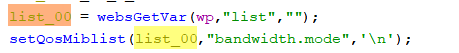
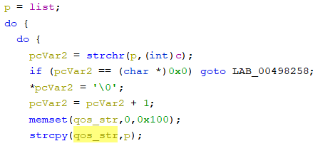

# Tenda Router Vulnerability on formSetQosBand function

This vulnerability lies in the `formSetQosBand` function in `httpd` binary on certain Tenda devices.

## Vulnerability Description

* Binary Path: /bin/httpd
* Entry Url: /SetNetControlList
* Affected Versions
    * AC1206 V15.03.06.23
    * AC8 V4 V16.03.34.06
    * AC5 V1.0 V15.03.06.28
    * AC10 v4.0 V16.03.10.13
    * AC9 V3.0 V15.03.06.42_multi
    
There is a **stack-based buffer overflow** vulnerability in function `formSetQosBand`. An attacker can set `list` field in requests to launch a denial-of-service or remote-code-execution attack.

In function `formSetQosBand` it reads user provided parameter `list` into `list_00`, this variable is passed into function `setQosMiblist`. In this function, the vulnerable variable is passed into function `strcpy` without any length check, which may overflow the stack-based buffer `qos_str`.

## Timeline

