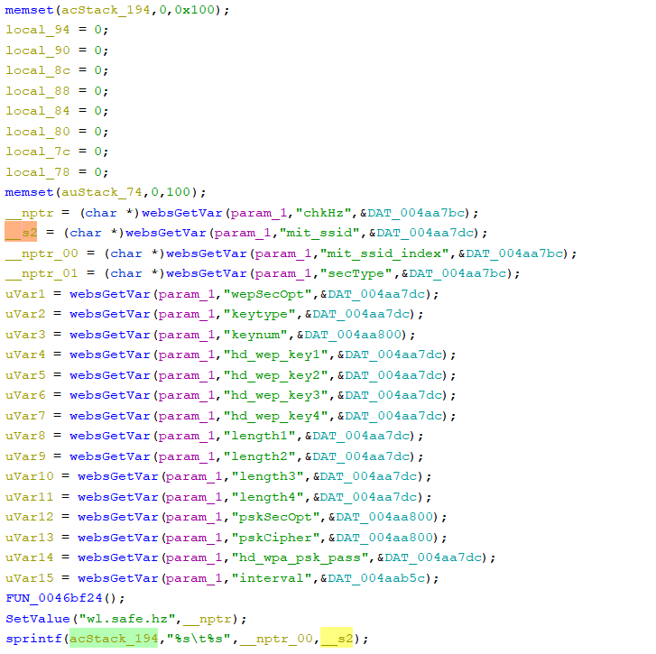

# Tenda F1202, FH1202 Vulnerability

This vulnerability lies in the `formWrlsafeset` function in `httpd` binary on the latest version of Tenda F1202 and FH1202.

## Vulnerability Description

* Binary Path: /bin/httpd
* Entry Url: /AdvSetWrlsafeset
* Affected Versions
    * F1202 V1.2.0.9
    * FH1202 V1.2.0.9

    
There is a **stack-based buffer overflow** vulnerability in function `formWrlsafeset`. An attacker can set `mit_ssid` field in requests to launch a denial-of-service or remote-code-execution attack.

In function `formWrlsafeset` it reads user provided parameter `mit_ssid` into `__s2`, this variable is passed into function `sprintf` without any length check, which may overflow the stack-based buffer `acStack_194`.

## Timeline

