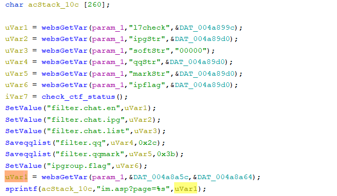

# Tenda F1202, PA202, PW201A, FH1202 Vulnerability

This vulnerability lies in the `/L7Im` page on the latest version of Tenda F1202, PA202, PW201A and FH1202.

## Vulnerability Description

* Binary Path: /bin/httpd or /usr/sbin/tenda_httpd
* Entry Url: /L7Im
* Affected Versions
    * F1202 V1.2.0.9
    * PA202 V1.1.2.5
    * PW201A V1.1.2.5
    * FH1202 V1.2.0.9
    
There is a **stack-based buffer overflow** vulnerability in page `/L7Im`. An attacker can set `page` field in requests to launch a denial-of-service or remote-code-execution attack.

In the vulnerability function, it reads user provided parameter `page` into `uVar1`, this variable is passed into function `sprintf` without any length check, which may overflow the stack-based buffer `acStack_10c`.

## Timeline

