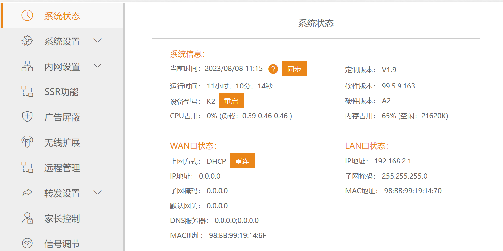
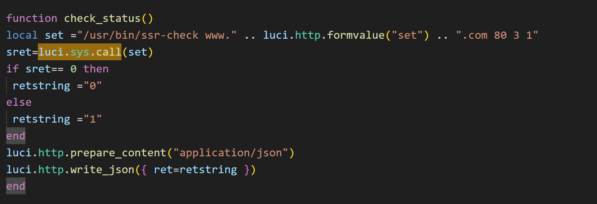
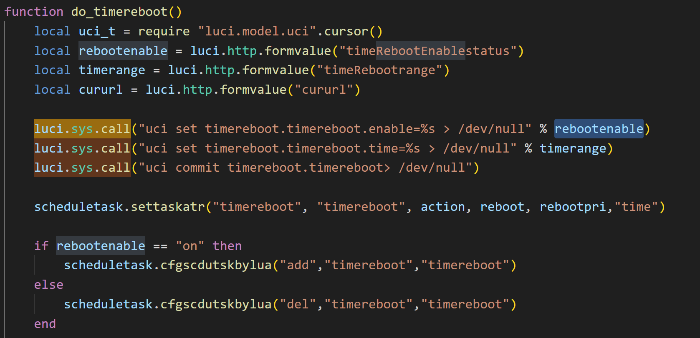
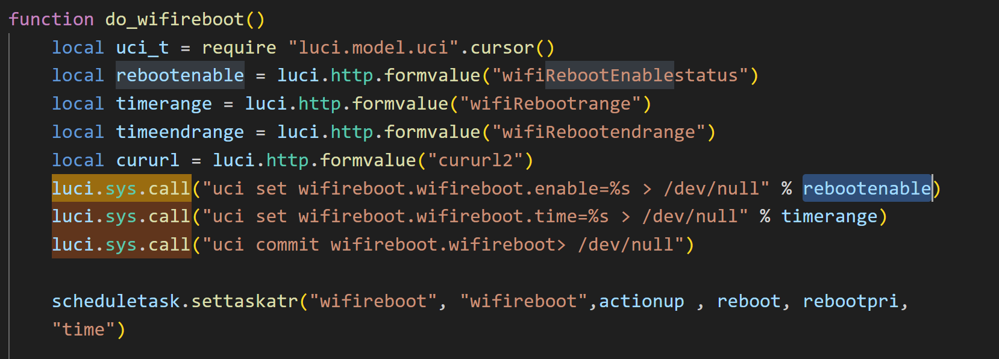
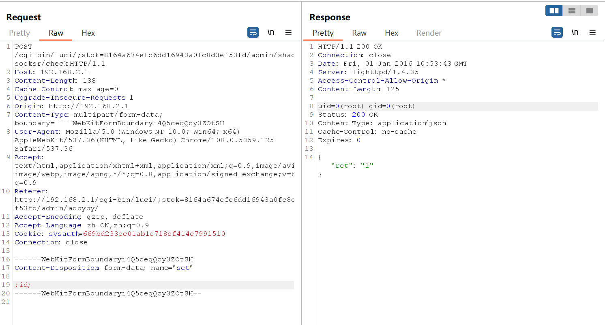
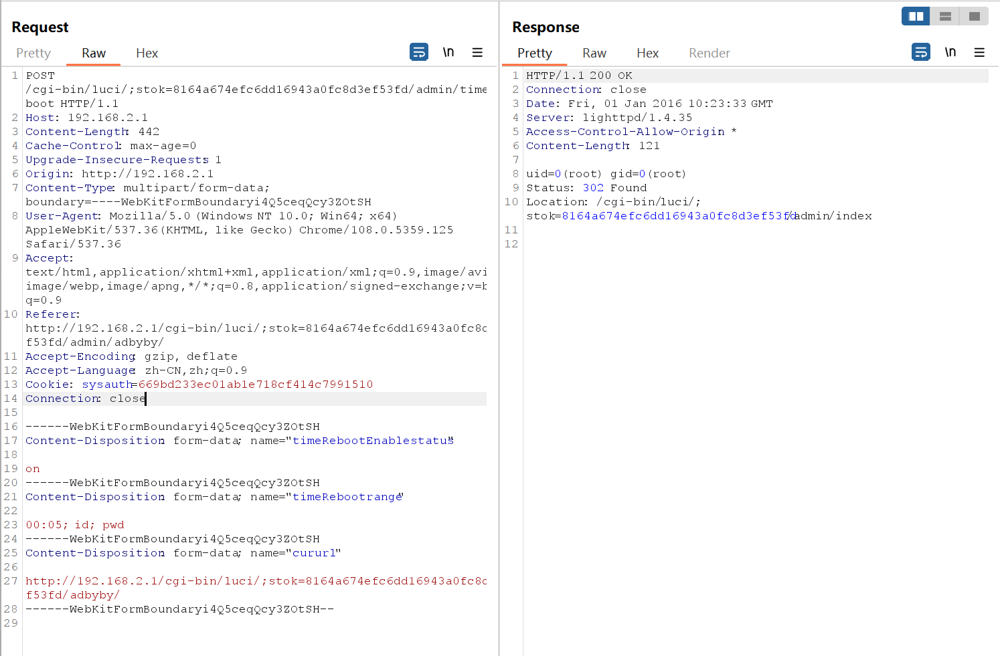
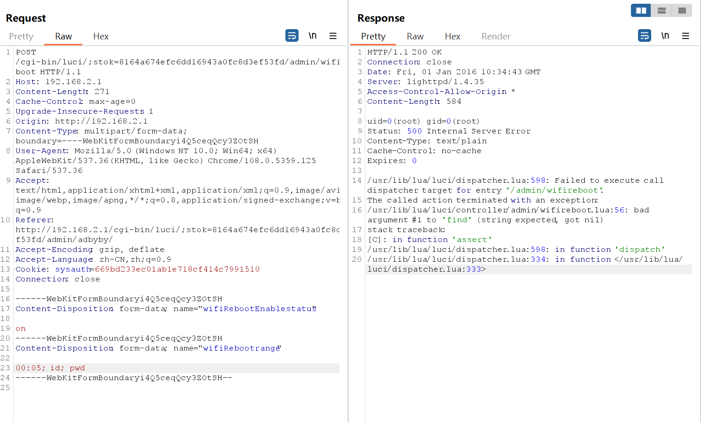

# Phicomm k2 V22.6.529.216 Command Injection vulnerability 

## Firmware information

- Vendor: Phicomm
- Version: k2 V22.6.529.216

## Affected version

I have verified that **Phicomm k2 V22.6.529.216** products have Command Injection vulnerability, and other series products have not been verified for the time being.

## Vulnerability details

`shadowsocksr.lua`

It is easy to find that the function concatenates the executed command with the content entered by the user, and directly invokes the luci.sys.call function to execute, resulting in command injection vulnerability.

Similarly, we can find the following functions with similar vulnerabilities.

`timerbooter.lua`

`wifireboot.lua`

## Poc

`shadowsocksr.lua`

`timerbooter.lua`

`wifireboot.lua`

